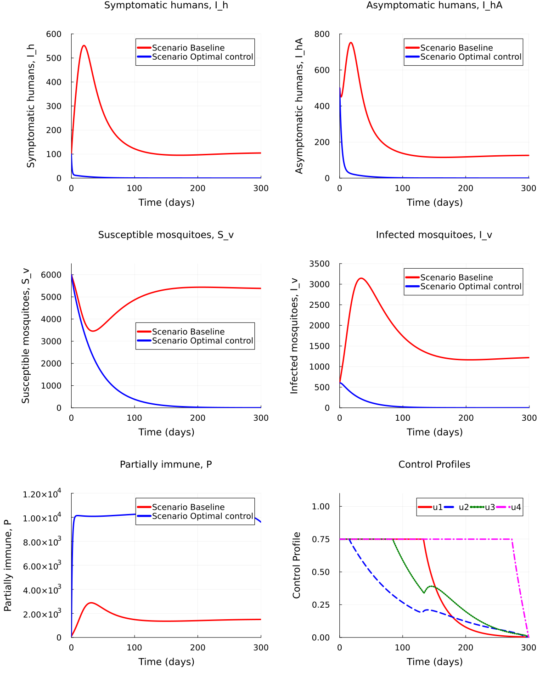

# Optimisation of Multiple Control Strategies on a Dengue Fever Model
using the Forward-Backward Sweep Method


Sandra Montes (@slmontes), 2026-01-26

## Introduction

This document presents the optimal control solution for the dengue fever
model using the forward-backward sweep method with 4th-order Runge-Kutta
integration. This approach implements Pontryagin’s maximum principle
numerically, as described by [Asamoah et
al. (2021)](https://www.sciencedirect.com/science/article/pii/S2211379721009487?via%3Dihub).
The same model and equations are used as in the file
[MultControl_Dengue](https://github.com/epirecipes/EpiPolicies/blob/main/MultipleControl/MultControl_Dengue.md),
but optimisation is performed iteratively rather than via a nonlinear
programming solver.

The model has two populations: human and mosquito (vector). The human
population is divided into susceptible `S_h`, infected (symptomatic)
`I_h`, carrier (asymptomatic) `I_hA`, partially immune `P`, and
recovered `R_h`. The mosquito population comprises susceptible `S_v` and
infected `I_v`.

The model is described by the following equations:

$$
\begin{aligned}
N_h(t) &= S_h(t) + I_h(t) + I_hA(t) + P(t) + R_h(t),\\
N_v(t) &= S_v(t) + I_v(t),\\
\\
\lambda_h(t) &= \frac{(1 - u_1(t)) b \beta_1}{N_h(t)} I_v(t),\\
\lambda_h1(t) &= \frac{(1 - u_1(t)) b \beta_2}{N_h(t)} I_v(t),\\
\lambda_v(t) &= \frac{b \beta_3}{N_h(t)} (I_h(t) + I_hA(t)).
\end{aligned}
$$

$$
\begin{aligned}
\frac{dS_h}{dt} &= \mu_h N_h - \lambda_h S_h - S_h u_2 - \mu_h S_h,\\
\frac{dI_h}{dt} &= \psi \lambda_h S_h + \omega \lambda_h1 P - (\mu_h + u_3 + \gamma_h) I_h,\\
\frac{dI_hA}{dt} &= (1 - \psi) \lambda_h S_h + (1 - \omega) \lambda_h1 P - (\mu_h + \gamma_h) I_hA,\\
\frac{dP}{dt} &= u_2 S_h + \rho u_3 I_h + \phi \gamma_h (I_h + I_hA) - \lambda_h1 P - \mu_h P,\\
\frac{dR_h}{dt} &= (1 - \rho) u_3 I_h + (1 - \phi) \gamma_h (I_h + I_hA) - \mu_h R_h,\\
\frac{dS_v}{dt} &= \mu_v N_v (1 - u_4) - \lambda_v S_v (1 - u_1) - \mu_v S_v - r_0 u_4 S_v,\\
\frac{dI_v}{dt} &= \lambda_v S_v (1 - u_1) - \mu_v I_v - r_0 u_4 I_v.
\end{aligned}
$$

Control selection is done via the `maxu` array: set `maxu[i] = 0` to
turn off control $u_i$, or `maxu[i] = 0.75` (or a value in $(0,0.75]$)
to enable it.

## Libraries

``` julia
using Plots
using Measures
Plots.default(fmt=:png)
```

## Parameters

``` julia
const T_final = 300.0
const h = 0.1
const num = Int(T_final / h)
const del = 0.001
const t = range(0, T_final, length = num + 1)

# Control upper bounds: OFF = 0, ON = max level (e.g. 0.75)
const maxu = [0.75, 0.75, 0.75, 0.75]

const mu_h = 0.004500
const beta_1 = 0.75
const b = 0.50
const psi = 0.4
const omega = 0.54
const beta_2 = 0.375
const gamma_h = 0.3288330
const rho = 0.01
const phi = 0.48
const r_0 = 0.005
const mu_v = 0.032300
const beta_3 = 0.75

const C_1 = 5.0
const C_2 = 5.0
const C_3 = 5.0
const D_1 = 16.62
const D_2 = 2.5
const D_3 = 5.0
const D_4 = 16.62
```

## Functions

### Forward state equations

``` julia
function forwards(tx, tu)
    S_h  = tx[1]
    I_h  = tx[2]
    I_hA = tx[3]
    P    = tx[4]
    R_h  = tx[5]
    S_v  = tx[6]
    I_v  = tx[7]

    u_1 = tu[1]
    u_2 = tu[2]
    u_3 = tu[3]
    u_4 = tu[4]

    N_h = S_h + I_h + I_hA + P + R_h
    N_v = S_v + I_v

    f1 = mu_h * N_h - (beta_1 * b / N_h) * S_h * I_v * (1 - u_1) - S_h * u_2 - mu_h * S_h
    f2 = (psi * beta_1 * b / N_h) * S_h * I_v * (1 - u_1) +
         omega * (beta_2 * b / N_h) * P * I_v * (1 - u_1) -
         (mu_h + u_3 + gamma_h) * I_h
    f3 = (1 - psi) * (beta_1 * b / N_h) * S_h * I_v * (1 - u_1) +
         (1 - omega) * (beta_2 * b / N_h) * P * I_v * (1 - u_1) -
         (mu_h + gamma_h) * I_hA
    f4 = u_2 * S_h + rho * u_3 * I_h + phi * gamma_h * (I_h + I_hA) -
         (beta_2 * b / N_h) * P * I_v * (1 - u_1) - mu_h * P
    f5 = (1 - rho) * u_3 * I_h + (1 - phi) * gamma_h * (I_h + I_hA) - mu_h * R_h
    f6 = mu_v * N_v * (1 - u_4) - (beta_3 * b / N_h) * S_v * (I_h + I_hA) * (1 - u_1) -
         mu_v * S_v - r_0 * u_4 * S_v
    f7 = (beta_3 * b / N_h) * S_v * (I_h + I_hA) * (1 - u_1) - mu_v * I_v - r_0 * u_4 * I_v

    return [f1, f2, f3, f4, f5, f6, f7]
end
```

### Adjoint equations (backward)

``` julia
function backwards(tx, tl, tu)
    S_h  = tx[1]
    I_h  = tx[2]
    I_hA = tx[3]
    P    = tx[4]
    R_h  = tx[5]
    S_v  = tx[6]
    I_v  = tx[7]

    lambda_1 = tl[1]
    lambda_2 = tl[2]
    lambda_3 = tl[3]
    lambda_4 = tl[4]
    lambda_5 = tl[5]
    lambda_6 = tl[6]
    lambda_7 = tl[7]

    u_1 = tu[1]
    u_2 = tu[2]
    u_3 = tu[3]
    u_4 = tu[4]

    N_h = S_h + I_h + I_hA + P + R_h

    ff1 = lambda_1 * (u_2 - (I_v * b * beta_1 * (u_1 - 1)) / N_h +
          (I_v * S_h * b * beta_1 * (u_1 - 1)) / N_h^2) -
          lambda_4 * (u_2 - (I_v * P * b * beta_2 * (u_1 - 1)) / N_h^2) -
          lambda_2 * ((I_v * P * b * beta_2 * omega * (u_1 - 1)) / N_h^2 -
          (I_v * b * beta_1 * psi * (u_1 - 1)) / N_h +
          (I_v * S_h * b * beta_1 * psi * (u_1 - 1)) / N_h^2) +
          lambda_3 * ((I_v * P * b * beta_2 * (omega - 1) * (u_1 - 1)) / N_h^2 -
          (I_v * b * beta_1 * (psi - 1) * (u_1 - 1)) / N_h +
          (I_v * S_h * b * beta_1 * (psi - 1) * (u_1 - 1)) / N_h^2) +
          (S_v * b * beta_3 * lambda_6 * (u_1 - 1) * (I_h + I_hA)) / N_h^2 -
          (S_v * b * beta_3 * lambda_7 * (u_1 - 1) * (I_h + I_hA)) / N_h^2

    ff2 = lambda_2 * (gamma_h + mu_h + u_3 -
          (I_v * P * b * beta_2 * omega * (u_1 - 1)) / N_h^2 -
          (I_v * S_h * b * beta_1 * psi * (u_1 - 1)) / N_h^2) - C_1 -
          lambda_6 * ((S_v * b * beta_3 * (u_1 - 1)) / N_h -
          (S_v * b * beta_3 * (u_1 - 1) * (I_h + I_hA)) / N_h^2) +
          lambda_7 * ((S_v * b * beta_3 * (u_1 - 1)) / N_h -
          (S_v * b * beta_3 * (u_1 - 1) * (I_h + I_hA)) / N_h^2) +
          lambda_5 * (gamma_h * (phi - 1) + u_3 * (rho - 1)) -
          lambda_1 * (mu_h - (I_v * S_h * b * beta_1 * (u_1 - 1)) / N_h^2) +
          lambda_3 * ((I_v * P * b * beta_2 * (omega - 1) * (u_1 - 1)) / N_h^2 +
          (I_v * S_h * b * beta_1 * (psi - 1) * (u_1 - 1)) / N_h^2) -
          lambda_4 * (gamma_h * phi + rho * u_3 -
          (I_v * P * b * beta_2 * (u_1 - 1)) / N_h^2)

    ff3 = lambda_7 * ((S_v * b * beta_3 * (u_1 - 1)) / N_h -
          (S_v * b * beta_3 * (u_1 - 1) * (I_h + I_hA)) / N_h^2) -
          lambda_4 * (gamma_h * phi -
          (I_v * P * b * beta_2 * (u_1 - 1)) / N_h^2) -
          lambda_6 * ((S_v * b * beta_3 * (u_1 - 1)) / N_h -
          (S_v * b * beta_3 * (u_1 - 1) * (I_h + I_hA)) / N_h^2) - C_2 +
          lambda_3 * (gamma_h + mu_h +
          (I_v * P * b * beta_2 * (omega - 1) * (u_1 - 1)) / N_h^2 +
          (I_v * S_h * b * beta_1 * (psi - 1) * (u_1 - 1)) / N_h^2) -
          lambda_1 * (mu_h -
          (I_v * S_h * b * beta_1 * (u_1 - 1)) / N_h^2) -
          lambda_2 * ((I_v * P * b * beta_2 * omega * (u_1 - 1)) / N_h^2 +
          (I_v * S_h * b * beta_1 * psi * (u_1 - 1)) / N_h^2) +
          gamma_h * lambda_5 * (phi - 1)

    ff4 = lambda_3 * ((I_v * P * b * beta_2 * (omega - 1) * (u_1 - 1)) / N_h^2 -
          (I_v * b * beta_2 * (omega - 1) * (u_1 - 1)) / N_h +
          (I_v * S_h * b * beta_1 * (psi - 1) * (u_1 - 1)) / N_h^2) -
          lambda_2 * ((I_v * P * b * beta_2 * omega * (u_1 - 1)) / N_h^2 -
          (I_v * b * beta_2 * omega * (u_1 - 1)) / N_h +
          (I_v * S_h * b * beta_1 * psi * (u_1 - 1)) / N_h^2) -
          lambda_1 * (mu_h -
          (I_v * S_h * b * beta_1 * (u_1 - 1)) / N_h^2) +
          lambda_4 * (mu_h -
          (I_v * b * beta_2 * (u_1 - 1)) / N_h +
          (I_v * P * b * beta_2 * (u_1 - 1)) / N_h^2) +
          (S_v * b * beta_3 * lambda_6 * (u_1 - 1) * (I_h + I_hA)) / N_h^2 -
          (S_v * b * beta_3 * lambda_7 * (u_1 - 1) * (I_h + I_hA)) / N_h^2

    ff5 = lambda_5 * mu_h -
          lambda_1 * (mu_h -
          (I_v * S_h * b * beta_1 * (u_1 - 1)) / N_h^2) +
          lambda_3 * ((I_v * P * b * beta_2 * (omega - 1) * (u_1 - 1)) / N_h^2 +
          (I_v * S_h * b * beta_1 * (psi - 1) * (u_1 - 1)) / N_h^2) -
          lambda_2 * ((I_v * P * b * beta_2 * omega * (u_1 - 1)) / N_h^2 +
          (I_v * S_h * b * beta_1 * psi * (u_1 - 1)) / N_h^2) +
          (I_v * P * b * beta_2 * lambda_4 * (u_1 - 1)) / N_h^2 +
          (S_v * b * beta_3 * lambda_6 * (u_1 - 1) * (I_h + I_hA)) / N_h^2 -
          (S_v * b * beta_3 * lambda_7 * (u_1 - 1) * (I_h + I_hA)) / N_h^2

    ff6 = lambda_6 * (mu_v + r_0 * u_4 + mu_v * (u_4 - 1) -
          (b * beta_3 * (u_1 - 1) * (I_h + I_hA)) / N_h) - C_3 +
          (b * beta_3 * lambda_7 * (u_1 - 1) * (I_h + I_hA)) / N_h

    ff7 = lambda_2 * ((S_h * b * beta_1 * psi * (u_1 - 1)) / N_h +
          (P * b * beta_2 * omega * (u_1 - 1)) / N_h) - C_3 +
          lambda_7 * (mu_v + r_0 * u_4) -
          lambda_3 * ((P * b * beta_2 * (omega - 1) * (u_1 - 1)) / N_h +
          (S_h * b * beta_1 * (psi - 1) * (u_1 - 1)) / N_h) +
          lambda_6 * mu_v * (u_4 - 1) -
          (P * b * beta_2 * lambda_4 * (u_1 - 1)) / N_h -
          (S_h * b * beta_1 * lambda_1 * (u_1 - 1)) / N_h

    return [ff1, ff2, ff3, ff4, ff5, ff6, ff7]
end
```

### RK4 baseline

``` julia
function runge_kutta_baseline(x0, num, h)
    x = zeros(7, num + 1)
    x[:, 1] = x0
    tempu = [0.0, 0.0, 0.0, 0.0]

    for i in 1:num
        tempx = x[:, i]
        k1 = forwards(tempx, tempu)
        tempx = x[:, i] .+ k1 .* 0.5 .* h
        k2 = forwards(tempx, tempu)
        tempx = x[:, i] .+ k2 .* 0.5 .* h
        k3 = forwards(tempx, tempu)
        tempx = x[:, i] .+ k3 .* h
        k4 = forwards(tempx, tempu)

        x[:, i+1] = max.(x[:, i] .+ (h / 6.0) .* (k1 .+ 2.0 .* k2 .+ 2.0 .* k3 .+ k4), 0.0)
    end

    return x
end
```

### Forward-backward sweep

``` julia
function forward_backward!(x, lambda, u, num, h)
    for i in 1:num
        tempu = (u[:, i] .+ u[:, i+1]) ./ 2.0
        tempx = x[:, i]
        k1 = forwards(tempx, tempu)
        tempx = x[:, i] .+ k1 .* 0.5 .* h
        k2 = forwards(tempx, tempu)
        tempx = x[:, i] .+ k2 .* 0.5 .* h
        k3 = forwards(tempx, tempu)
        tempx = x[:, i] .+ k3 .* h
        k4 = forwards(tempx, tempu)

        x[:, i+1] = max.(x[:, i] .+ (h / 6.0) .* (k1 .+ 2.0 .* k2 .+ 2.0 .* k3 .+ k4), 0.0)
    end

    for i in num:-1:1
        tempx = (x[:, i] .+ x[:, i+1]) ./ 2.0
        tempu = (u[:, i] .+ u[:, i+1]) ./ 2.0

        tlambda = lambda[i+1, :]
        k1 = backwards(tempx, tlambda, tempu)
        tlambda = lambda[i+1, :] .- k1 .* 0.5 .* h
        k2 = backwards(tempx, tlambda, tempu)
        tlambda = lambda[i+1, :] .- k2 .* 0.5 .* h
        k3 = backwards(tempx, tlambda, tempu)
        tlambda = lambda[i+1, :] .- k3 .* h
        k4 = backwards(tempx, tlambda, tempu)

        lambda[i, :] = lambda[i+1, :] .- (h / 6.0) .* (k1 .+ 2.0 .* k2 .+ 2.0 .* k3 .+ k4)
    end

    return u, x, lambda
end
```

### Plotting

``` julia
function printout(t, x, uu, xout, num; P_axis=3000, save=false)
    susceptibleprevented = sum(xout[1, :]) - sum(x[1, :])
    println("Susceptible prevented: ", susceptibleprevented)

    AvertedI_h  = sum(xout[2, :] .- x[2, :])
    AvertedI_hA = sum(xout[3, :] .- x[3, :])
    IATotal = AvertedI_h + AvertedI_hA
    println("Averted I_h:  ", AvertedI_h)
    println("Averted I_hA: ", AvertedI_hA)
    println("Total I averted:     ", IATotal)

    color_palette = [:red, :blue, :green, :magenta, :purple, :cyan, :orange, :yellow]
    linestyle_palette = [:solid, :dash, :dot, :dashdot]

    I_h_opts = [xout[2, :], x[2, :]]
    I_hA_opts = [xout[3, :], x[3, :]]
    S_v_opts = [xout[6, :], x[6, :]]
    I_v_opts = [xout[7, :], x[7, :]]
    P_opts = [xout[4, :], x[4, :]]
    scenario_label = ["Baseline", "Optimal control"]

    combined_plot = plot(layout=(3, 2), dpi=300, size=(1200, 1500),
        left_margin=10mm, right_margin=10mm, top_margin=10mm, bottom_margin=10mm)

    for (i, I_h_opt) in enumerate(I_h_opts)
        plot!(combined_plot[1, 1], t, I_h_opt,
            label="Scenario $(scenario_label[i])",
            linewidth=3, color=color_palette[i], thickness_scaling=1,
            xlim=(0, t[end]), ylim=(0, 600),
            xtickfontsize=12, ytickfontsize=12,
            xguidefontsize=14, yguidefontsize=14,
            legendfontsize=12, legend=:topright)
    end
    xlabel!(combined_plot[1, 1], "Time (days)")
    ylabel!(combined_plot[1, 1], "Symptomatic humans, I_h")
    title!(combined_plot[1, 1], "Symptomatic humans, I_h")

    for (i, I_hA_opt) in enumerate(I_hA_opts)
        plot!(combined_plot[1, 2], t, I_hA_opt,
            label="Scenario $(scenario_label[i])",
            linewidth=3, color=color_palette[i], thickness_scaling=1,
            xlim=(0, t[end]+1), ylim=(0, 800),
            xtickfontsize=12, ytickfontsize=12,
            xguidefontsize=14, yguidefontsize=14,
            legendfontsize=12, legend=:topright)
    end
    xlabel!(combined_plot[1, 2], "Time (days)")
    ylabel!(combined_plot[1, 2], "Asymptomatic humans, I_hA")
    title!(combined_plot[1, 2], "Asymptomatic humans, I_hA")

    for (i, S_v_opt) in enumerate(S_v_opts)
        plot!(combined_plot[2, 1], t, S_v_opt,
            label="Scenario $(scenario_label[i])",
            linewidth=3, color=color_palette[i], thickness_scaling=1,
            xlim=(0, t[end]), ylim=(0, 6500),
            xtickfontsize=12, ytickfontsize=12,
            xguidefontsize=14, yguidefontsize=14,
            legendfontsize=12, legend=:right)
    end
    xlabel!(combined_plot[2, 1], "Time (days)")
    ylabel!(combined_plot[2, 1], "Susceptible mosquitoes, S_v")
    title!(combined_plot[2, 1], "Susceptible mosquitoes, S_v")

    for (i, I_v_opt) in enumerate(I_v_opts)
        plot!(combined_plot[2, 2], t, I_v_opt,
            label="Scenario $(scenario_label[i])",
            linewidth=3, color=color_palette[i], thickness_scaling=1,
            xlim=(0, t[end]), ylim=(0, 3500),
            xtickfontsize=12, ytickfontsize=12,
            xguidefontsize=14, yguidefontsize=14,
            legendfontsize=12, legend=:topright)
    end
    xlabel!(combined_plot[2, 2], "Time (days)")
    ylabel!(combined_plot[2, 2], "Infected mosquitoes, I_v")
    title!(combined_plot[2, 2], "Infected mosquitoes, I_v")

    for (i, P_opt) in enumerate(P_opts)
        plot!(combined_plot[3, 1], t, P_opt,
            label="Scenario $(scenario_label[i])",
            linewidth=3, color=color_palette[i], thickness_scaling=1,
            xlim=(0, t[end]), ylim=(0, P_axis),
            xtickfontsize=12, ytickfontsize=12,
            xguidefontsize=14, yguidefontsize=14,
            legendfontsize=12, legend=:topright)
    end
    xlabel!(combined_plot[3, 1], "Time (days)")
    ylabel!(combined_plot[3, 1], "Partially immune, P")
    title!(combined_plot[3, 1], "Partially immune, P")

    for (i, u_row) in enumerate(eachrow(uu[:, 1:num+1]))
        plot!(combined_plot[3, 2], t, u_row,
            label="u$i", linewidth=3, color=color_palette[i],
            linestyle=linestyle_palette[i], thickness_scaling=1,
            xlim=(0, t[end]+1), ylim=(0, 1.1),
            xtickfontsize=12, ytickfontsize=12,
            xguidefontsize=14, yguidefontsize=14,
            legendfontsize=12, legend_columns=4, legend=:topright)
    end
    xlabel!(combined_plot[3, 2], "Time (days)")
    ylabel!(combined_plot[3, 2], "Control Profile")
    title!(combined_plot[3, 2], "Control Profiles")

    display(combined_plot)

    if save
        filename = "DengueOptimal_forwardBackward.png"
        savefig(combined_plot, filename)
    end
end
```

## Running the model

### Initial conditions and baseline simulation

``` julia
x0 = [10000.0, 100.0, 500.0, 100.0, 1000.0, 6000.0, 600.0]

# Baseline (no control) simulation
xout = runge_kutta_baseline(x0, num, h)
```

### Optimal control via forward-backward sweep

``` julia
tu     = zeros(4, num + 1)
x      = zeros(7, num + 1)
lambda = zeros(num + 1, 7)

x[:, 1] = x0

test = -5.0
k = 0
```

``` julia
tx = x
tl = lambda
while test < 1e-8
    forward_backward!(x, lambda, tu, num, h)
    tx = x
    tl = lambda

    S_h  = tx[1, :]
    I_h  = tx[2, :]
    I_hA = tx[3, :]
    P    = tx[4, :]
    R_h  = tx[5, :]
    S_v  = tx[6, :]
    I_v  = tx[7, :]

    lambda_1 = tl[:, 1]
    lambda_2 = tl[:, 2]
    lambda_3 = tl[:, 3]
    lambda_4 = tl[:, 4]
    lambda_5 = tl[:, 5]
    lambda_6 = tl[:, 6]
    lambda_7 = tl[:, 7]

    u_1 = tu[1, :]
    u_2 = tu[2, :]
    u_3 = tu[3, :]
    u_4 = tu[4, :]

    oldu_1 = copy(u_1)
    oldu_2 = copy(u_2)
    oldu_3 = copy(u_3)
    oldu_4 = copy(u_4)

    oldtu = copy(tu)
    oldtx = copy(tx)
    oldtl = copy(tl)

    N_h = I_h .+ I_hA .+ P .+ R_h .+ S_h

    tempu_1 = -(lambda_3 .* ((I_v .* P .* b .* beta_2 .* (omega - 1)) ./ N_h .+
               (I_v .* S_h .* b .* beta_1 .* (psi - 1)) ./ N_h) .-
               lambda_2 .* ((I_v .* P .* b .* beta_2 .* omega) ./ N_h .+
               (I_v .* S_h .* b .* beta_1 .* psi) ./ N_h) .+
               (S_v .* b .* beta_3 .* lambda_6 .* (I_h .+ I_hA)) ./ N_h .-
               (S_v .* b .* beta_3 .* lambda_7 .* (I_h .+ I_hA)) ./ N_h .+
               (I_v .* P .* b .* beta_2 .* lambda_4) ./ N_h .+
               (I_v .* S_h .* b .* beta_1 .* lambda_1) ./ N_h) ./ D_1
    u_11 = min.(maxu[1], max.(tempu_1, 0.0))
    u_1 = 0.5 .* (u_11 .+ oldu_1)

    tempu_2 = (S_h .* lambda_1 .- S_h .* lambda_4) ./ D_2
    u_21 = min.(maxu[2], max.(tempu_2, 0.0))
    u_2 = 0.5 .* (u_21 .+ oldu_2)

    tempu_3 = (I_h .* lambda_2 .- I_h .* lambda_4 .* rho .+
               I_h .* lambda_5 .* (rho - 1)) ./ D_3
    u_31 = min.(maxu[3], max.(tempu_3, 0.0))
    u_3 = 0.5 .* (u_31 .+ oldu_3)

    tempu_4 = (lambda_6 .* (S_v .* r_0 .+ mu_v .* (I_v .+ S_v)) .+
               I_v .* lambda_7 .* r_0) ./ D_4
    u_41 = min.(maxu[4], max.(tempu_4, 0.0))
    u_4 = 0.5 .* (u_41 .+ oldu_4)

    tu[1, :] = u_1
    tu[2, :] = u_2
    tu[3, :] = u_3
    tu[4, :] = u_4

    k += 1

    test = minimum(vcat(
        vec(del .* sum(tu, dims=1) .- sum(oldtu .- tu, dims=1)),
        vec(del .* sum(tx, dims=1) .- sum(oldtx .- tx, dims=1)),
        vec(del .* sum(tl, dims=1) .- sum(oldtl .- tl, dims=1))
    ))

    println("Iteration $k, test = $test")

    if k > 50
        println("Maximum iterations (50) reached. Breaking.")
        break
    end
end

println("Control optimisation finished after $k iterations.")
```

    Iteration 1, test = 0.0
    Iteration 2, test = -2.126873423637393
    Iteration 3, test = -0.5529557764894668
    Iteration 4, test = -0.33483032964410175
    Iteration 5, test = -0.2481743057049839
    Iteration 6, test = -0.21930317397047386
    Iteration 7, test = -0.20640150050447678
    Iteration 8, test = -0.20037488231647277
    Iteration 9, test = -0.19751377075492985
    Iteration 10, test = -0.1961445875462777
    Iteration 11, test = -0.1954908363979048
    Iteration 12, test = -0.19517965161602094
    Iteration 13, test = -0.19503299875897342
    Iteration 14, test = -0.19496462111912277
    Iteration 15, test = -0.19493333039883656
    Iteration 16, test = -0.1949193474271219
    Iteration 17, test = -0.19491333844390207
    Iteration 18, test = -0.1949109084344832
    Iteration 19, test = -0.19491003569654633
    Iteration 20, test = -0.1949098023462997
    Iteration 21, test = -0.19490980757158474
    Iteration 22, test = -0.19490988333218875
    Iteration 23, test = -0.19490996547340106
    Iteration 24, test = -0.19491003336059684
    Iteration 25, test = -0.19491008364926266
    Iteration 26, test = -0.19491011877740408
    Iteration 27, test = -0.19491014246718505
    Iteration 28, test = -0.19491015807949794
    Iteration 29, test = -0.19491016821079013
    Iteration 30, test = -0.1949101747147381
    Iteration 31, test = -0.19491017885890863
    Iteration 32, test = -0.19491018148559405
    Iteration 33, test = -0.19491018314446357
    Iteration 34, test = -0.19491018418956343
    Iteration 35, test = -0.19491018484697656
    Iteration 36, test = -0.19491018526014964
    Iteration 37, test = -0.19491018551972145
    Iteration 38, test = -0.19491018568278937
    Iteration 39, test = -0.19491018578525654
    Iteration 40, test = -0.1949101858496709
    Iteration 41, test = -0.19491018589018722
    Iteration 42, test = -0.19491018591568762
    Iteration 43, test = -0.19491018593174886
    Iteration 44, test = -0.19491018594187154
    Iteration 45, test = -0.19491018594825715
    Iteration 46, test = -0.19491018595228826
    Iteration 47, test = -0.1949101859548342
    Iteration 48, test = -0.19491018595644377
    Iteration 49, test = -0.19491018595746182
    Iteration 50, test = -0.19491018595810655
    Iteration 51, test = -0.19491018595851464
    Maximum iterations (50) reached. Breaking.
    Control optimisation finished after 51 iterations.

### Results

    Susceptible prevented: 3.2360407312193904e6
    Averted I_h:  489550.00831051444
    Averted I_hA: 581074.1351253614
    Total I averted:     1.070624143435876e6


