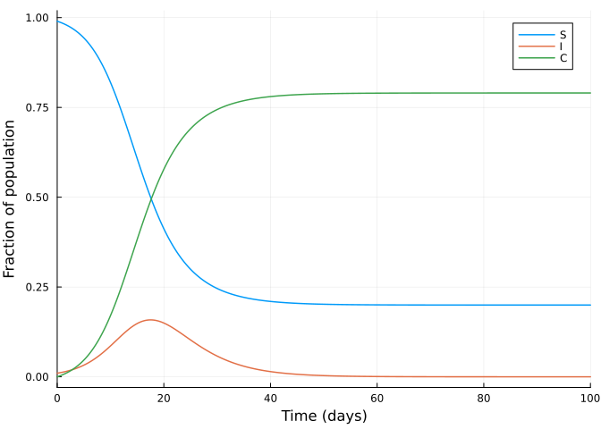
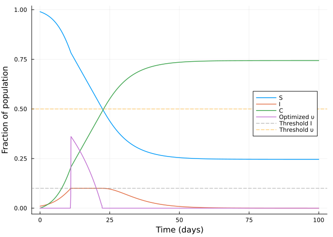

# ‘Flattening the curve’ optimisation on an SIR model using JuMP.jl


Initial version
[here](https://github.com/epirecipes/sir-julia/blob/master/markdown/function_map_ftc_jump/function_map_ftc_jump.md)
by Simon Frost (@sdwfrost)  
Current version Sandra Montes (@slmontes), 2025-03-10

## Introduction

This example explores the optimal control of an SIR
(Susceptible-Infected-Recovered) model using a time-varying intervention
that reduces the infection rate, similar to the lockdown example.

The following differential equations also describe this model :

$$
\begin{aligned}
\dfrac{\mathrm{d}S}{\mathrm{dt}} &= -\beta (1 - \upsilon(t)) S I, \\
\dfrac{\mathrm{d}I}{\mathrm{dt}} &= \beta (1 - \upsilon(t)) S I - \gamma I, \\
\dfrac{\mathrm{d}C}{\mathrm{dt}} &= \beta (1 - \upsilon(t)) S I,
\end{aligned}
$$

In this case, the optimal control problem is formulated to minimise the
total intervention cost, measured as the integral of `υ(t)` over time
while ensuring that the number of infected individuals, `I`, stays below
a set threshold `I_max`. This constraint is introduced to achieve the
objective of ‘flattening the curve,’ meaning that the optimal
intervention policy `υ(t)` balances the cost of intervention with the
need to keep the infection spread manageable, ensuring that the number
of infected individuals never exceeds the threshold `I_max`. Again, we
determine the optimal policy numerically using a simple Euler
discretisation and then JuMP.jl with IPOPT to optimise.

## Libraries

``` julia
using OrdinaryDiffEq
using DiffEqCallbacks
using JuMP
using Ipopt
using Plots
using DataInterpolations
using NonlinearSolve;
```

## Functions

ODE system

``` julia
function sir_ode!(du,u,p,t)
    (S, I, C) = u
    (β, γ, υ) = p
    @inbounds begin
        du[1] = -β*(1-υ)*S*I
        du[2] = β*(1-υ)*S*I - γ*I
        du[3] = β*(1-υ)*S*I
    end
    nothing
end;
```

## Running the model without intervention

Parameters

``` julia
u0 = [0.99, 0.01, 0.0]; #S, I, C (cumulative incidence)
p = [0.5, 0.25, 0]; # β, γ, υ
```

``` julia
t0 = 0.0
tf = 100
dt = 0.1
ts = collect(t0:dt:tf)
alg = Tsit5();
```

Solve using ODEProblem

``` julia
prob1 = ODEProblem(sir_ode!, u0, (t0, tf), p)
sol1 = solve(prob1, alg, saveat=ts);
```

Without control the peak fraction of infected individuals is:

``` julia
peak_value, peak_index = findmax(sol1[2, :]) 
println("The maximum fraction of infected at a `dt` time is: ", peak_value)
```

    The maximum fraction of infected at a `dt` time is: 0.15845528864997238

``` julia
plot(sol1,
     xlim=(0, 100),
     labels=["S" "I" "C"],
     xlabel="Time (days)",
     ylabel="Fraction of population",linewidth=1.5)
```



## Searching for the optimal intervention constrained by `I_max`

Parameters

``` julia
p2 = copy(p)
p2[3] = 0.5;   #Set υ to 0.5
β = p2[1]
γ = p2[2]
υ_max = p2[3]
I_max = 0.1

S0 = u0[1]
I0 = u0[2]
C0 = u0[3]

T = Int(tf/dt)

silent = true;
```

Model setup

``` julia
model = Model(Ipopt.Optimizer)
set_optimizer_attribute(model, "max_iter", 1000)
if !silent
    set_optimizer_attribute(model, "output_file", "JuMP_ftc.txt")
    set_optimizer_attribute(model, "print_timing_statistics", "yes")
end;
```

Variables:

We declare the number of timesteps, `T`, and vectors of our model
variables, including the intervention level, `ν`, each `T+1` step long.
We also define the total cost of the intervention, `υ_total` as a
variable. From their definition, the variables `S` and `C` are
constrained to values between 0 and 1. While the variables `I` and `υ`
are constrained to values between 0 and their respective maximum value
previously defined.

``` julia
@variable(model, 0 <= S[1:(T+1)] <= 1)
@variable(model, 0 <= I[1:(T+1)] <= I_max)
@variable(model, 0 <= C[1:(T+1)] <= 1)
@variable(model, 0 <= υ[1:(T+1)] <= υ_max)
@variable(model, υ_total);
```

We discretise the SIR model using a simple Euler discretisation:

``` julia
@expressions(model, begin
        infection[t in 1:T], (1 - υ[t]) * β * I[t] * dt * S[t]  # Linear approximation of infection rate
        recovery[t in 1:T], γ * dt * I[t] # Recoveries at each time step
    end);
```

We constrain our model so the integral of the intervention is equal to
`υ_total`, assuming that the intervention is piecewise constant during
each time step.

``` julia
@constraints(model, begin
    S[1]==S0
    I[1]==I0
    C[1]==C0
    [t=1:T], S[t+1] == S[t] - infection[t]
    [t=1:T], I[t+1] == I[t] + infection[t] - recovery[t]
    [t=1:T], C[t+1] == C[t] + infection[t]
    dt * sum(υ[t] for t in 1:T+1) == υ_total
end);
```

This scenario’s objective is to minimise the total cost of intervention
instead of the cumulative incidence, as in the previous single lockdown
scenario.

``` julia
@objective(model, Min, υ_total);
```

``` julia
if silent
    set_silent(model)
end
optimize!(model)
```

``` julia
termination_status(model)
```

    LOCALLY_SOLVED::TerminationStatusCode = 4

``` julia
S_opt = value.(S)
I_opt = value.(I)
C_opt = value.(C)
υ_opt = value.(υ);
```

``` julia
plot(ts, S_opt, label="S", xlabel="Time (days)", ylabel="Fraction of population", legend=:right,linewidth=1.5)
plot!(ts, I_opt, label="I",linewidth=1.5)
plot!(ts, C_opt, label="C",linewidth=1.5)
plot!(ts, υ_opt, label="Optimized υ",linewidth=1.5)
hline!([I_max], color=:gray, alpha=0.5, linestyle=:dash, label="Threshold I",linewidth=1.5)
hline!([υ_max], color=:orange, alpha=0.5, linestyle=:dash, label="Threshold υ",linewidth=1.5)
```



With the optimised intervention, we can confirm that the maximum number
of fraction of infected does not exceed `I_max`:

``` julia
peak_value_opt, peak_index_opt = findmax(I_opt) 
println("The maximum fraction of infected at a `dt` time is: ", peak_value_opt)
```

    The maximum fraction of infected at a `dt` time is: 0.1000000099370598

Again, we can calculate the effective reproductive number, `Rₜ′` in the
presence of the intervention:

``` julia
Rₜ_opt = β.* S_opt ./γ   #Not taking into account the intervention
Rₜ′_opt = Rₜ_opt .* (1 .- υ_opt);  #Taking into account the intervention
```

And the time at which `Rₜ==1` using a root-finding approach:

``` julia
Rₜ_interp = CubicSpline(Rₜ_opt,ts)
f(u, p) = [Rₜ_interp(u[1]) - 1.0]
u0 = [(tf-t0)/3]
Rtprob = NonlinearProblem(f, u0)
Rtsol = solve(Rtprob, NewtonRaphson(), abstol = 1e-9).u[1];
```

``` julia
plot(ts, Rₜ_opt, label="Rₜ", xlabel="Time (days)", ylabel="Effective reproductive number", legend=:topright, xlim=(0,60),linewidth=1.5)
plot!(ts, Rₜ′_opt, label="Rₜ optimised",linewidth=1.5)
plot!(ts, υ_opt, label="Optimized υ",linewidth=1.5)
vline!([Rtsol], color=:gray, linestyle=:dash, alpha=0.5, label=false,linewidth=1.5)
hline!([1.0], color=:gray, linestyle=:dash, alpha=0.5, label=false,linewidth=1.5)
```


## Discussion

The optimal policy obtained involves a single lockdown that increases
rapidly at or shortly before the infected population reaches its
threshold level. Once this threshold is reached, the intensity of the
lockdown is gradually reduced. We can view the total cost as the area
under the policy curve.

The plot of `Rₜ` over time shows that the intervention targets `Rₜ=1`
(including intervention) at the threshold level of infected individuals
and that the lockdown stops when `Rₜ==1` in the absence of an
intervention, ensuring that the population of infected individuals does
not increase.

Compared to a model designed to minimise the total number of infections,
the current strategy that keeps the infected population below a certain
threshold while minimising intervention costs also leads to a single
intervention period. However, in this case, the strength of the
intervention decreases over time.

It is important to mention that there are significant challenges in
translating this finding into actual intervention policies. Fine-tuning
the intensity of the intervention over time may not be feasible;
instead, a series of staged interventions with varying intensities might
be necessary. The impact of the intervention may be uncertain prior to
implementation, and if the efficacy is lower, it may require initiating
the intervention well in advance before reaching the infected threshold.
Additionally, determining when to stop the intervention requires
knowledge of the effective reproduction number (the ‘R number’) in the
absence of the intervention. This requires reliable estimates of `Rₜ`
and the intensity of the intervention, `υ`. These uncertainties are in
addition to the usual uncertainty in model structure and parameter
values of the underlying model.
