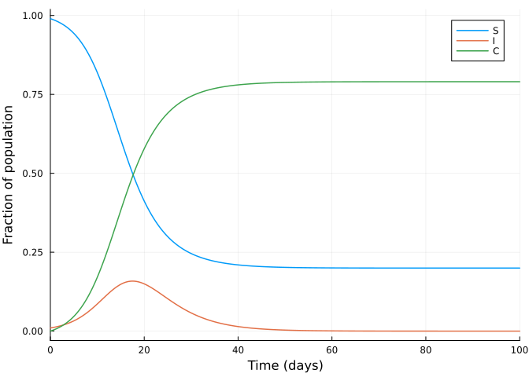
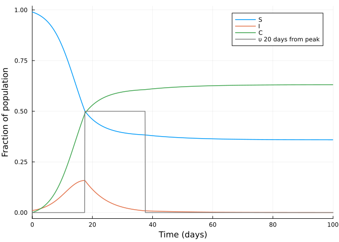
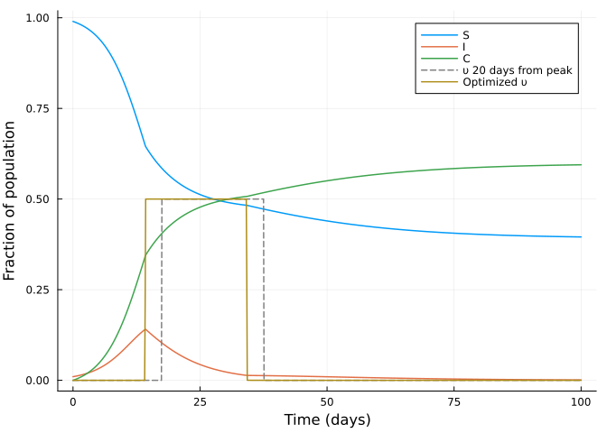
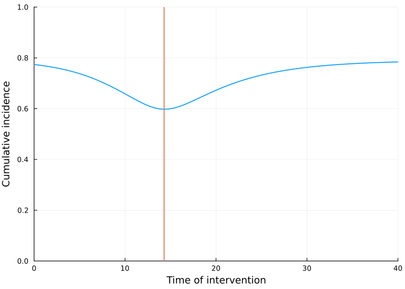

# Lockdown optimisation on an SIR model using JuMP.jl


Initial version
[here](https://github.com/epirecipes/sir-julia/blob/master/markdown/function_map_lockdown_jump/function_map_lockdown_jump.md)
by Simon Frost (@sdwfrost)  
Current version Sandra Montes (@slmontes), 2025-03-10

## Introduction

This example explores the optimal control of an SIR
(Susceptible-Infected-Recovered) model using a time-varying intervention
that reduces the infection rate. The population is divided into three
categories: susceptible individuals (`S`), infected individuals (`I`),
and the total number of cases (`C`). The intervention is modelled as a
time-dependent control variable `υ(t)` that reduces the transmission
rate by a factor of `1 - υ(t)`. The goal is to determine the optimal
timing and application of this intervention to minimise the final number
of cases (`C`) under the following constraints: (a) `υ` cannot exceed a
maximum value, and (b) the total cost, measured as the integral of `υ`
over time, must remain within a specified limit.

The model is described by the following differential equations:

$$
\begin{aligned}
\dfrac{\mathrm{d}S}{\mathrm{dt}} &= -\beta (1 - \upsilon(t)) S I, \\
\dfrac{\mathrm{d}I}{\mathrm{dt}} &= \beta (1 - \upsilon(t)) S I - \gamma I, \\
\dfrac{\mathrm{d}C}{\mathrm{dt}} &= \beta (1 - \upsilon(t)) S I,
\end{aligned}
$$

Here, `β` is the transmission rate, and `γ` is the recovery rate.

In a study by [Britton and Leskela
(2022)](https://epubs.siam.org/doi/10.1137/22M1504433), it was
demonstrated that the optimal strategy for controlling the epidemic
under the above model involves a single lockdown at a set maximum
intervention level for `υ`, sustained until the cost reaches the
specified threshold. To determine whether the optimal policy can be
identified numerically, we use a simple Euler discretisation and then
use JuMP.jl with IPOPT to optimise.

## Libraries

``` julia
using OrdinaryDiffEq
using DiffEqCallbacks
using JuMP
using Ipopt
using Plots
using DataInterpolations
using NonlinearSolve;
```

## Functions

ODE system

``` julia
function sir_ode!(du,u,p,t)
    (S, I, C) = u
    (β, γ, υ) = p
    @inbounds begin
        du[1] = -β*(1-υ)*S*I
        du[2] = β*(1-υ)*S*I - γ*I
        du[3] = β*(1-υ)*S*I
    end
    nothing
end;
```

SIR simulation

``` julia
function simulate(p, u0, t₁, dur, ss, alg)
    t₂ = t₁ + dur
    lockdown_times = [t₁, t₂]
    β, γ, υ = p
    function affect!(integrator)
        if integrator.t < lockdown_times[2]
            integrator.p[3] = υ
        else
            integrator.p[3] = 0.0
        end
    end
    cb = PresetTimeCallback(lockdown_times, affect!)
    tspan = (0.0, t₂+ss)
    # Start with υ=0   
    prob = ODEProblem(sir_ode!, u0, tspan, [β, γ, 0.0])
    sol = solve(prob, alg, callback = cb)
    return sol
end;
```

Calculate the total number of infected at the end of simulation

``` julia
function final_size(p, u0, t₁, dur, ss, alg)
    sol = simulate(p, u0, t₁, dur, ss, alg)
    return sol[end][3]
end;
```

## Running the model without intervention

Parameters

``` julia
u0 = [0.99, 0.01, 0.0]; #S, I, C (cumulative incidence)
p = [0.5, 0.25, 0]; # β, γ, υ
```

``` julia
t0 = 0.0
tf = 100
dt = 0.1
ts = collect(t0:dt:tf)
alg = Tsit5();
```

Solve using ODEProblem

``` julia
prob1 = ODEProblem(sir_ode!, u0, (t0, tf), p)
sol1 = solve(prob1, alg, saveat=ts);
```

Without control the final size of total number of cases is $\sim$ 79%

``` julia
fianl_C_sol1 = sol1[end][3]
println("Cumulative incidence fraction without control: ", fianl_C_sol1)
```

    Cumulative incidence fraction without control: 0.7901973301721557

``` julia
plot(sol1,
     xlim=(0, 100),
     labels=["S" "I" "C"],
     xlabel="Time (days)",
     ylabel="Fraction of population")
```



Now we find the peak value of infected individuals and the time at which
it occurs:

``` julia
peak_value, peak_index = findmax(sol1[2, :]) 
peak_time = sol1.t[peak_index]
println("The peak of infections occurs at time: ", peak_time)
```

    The peak of infections occurs at time: 17.5

## Running the model with intervention initiated at the peak of infected cases

Demonstrating the impact of an intervention when initiated at the peak
of infected cases.  
Parameters:

``` julia
p2 = copy(p)
p2[3] = 0.5;   #Set υ to 0.5
t₁ = peak_time
dur = 20.0  #Duration of the intervention
ss = 100.0;
```

Simulate with intervention

``` julia
sol2 = simulate(p2, u0, t₁, dur, ss, alg);
```

With control starting at the peak of infections and lasting 20 days, the
final size of total number of cases is $\sim$ 63%

``` julia
fianl_C_sol2 = sol2[end][3]
println("Cumulative incidence fraction when control starts at the peak: ", fianl_C_sol2)
```

    Cumulative incidence fraction when control starts at the peak: 0.6312297734622068

``` julia
# create a vector that shows the υ value for each time step
υ_test = zeros(length(ts))
for i in 1:length(ts)
    if ts[i] >= t₁ && ts[i] <= (t₁ + dur)
        υ_test[i] = 0.5  # Set to 0.5 within the time interval
    end
end
```

``` julia
plot(sol2,
     xlim=(0, 100),
     labels=["S" "I" "C"],
     xlabel="Time (days)",
     ylabel="Fraction of population")
plot!(ts, υ_test, color=:gray, label="υ 20 days from peak")
```



## Searching for the optimal intervention time

Parameters

``` julia
β = p2[1]
γ = p2[2]
υ_max = p2[3]
υ_total = 10.0; # maximum cost

S0 = u0[1]
I0 = u0[2]
C0 = u0[3]

T = Int(tf/dt)

silent = true;
```

Model setup

``` julia
model = Model(Ipopt.Optimizer)
set_optimizer_attribute(model, "max_iter", 1000)
if !silent
    set_optimizer_attribute(model, "output_file", "JuMP_lockdown.txt")
    set_optimizer_attribute(model, "print_timing_statistics", "yes")
end;
```

Variables:

``` julia
@variable(model, 0 <= S[1:(T+1)] <= 1)
@variable(model, 0 <= I[1:(T+1)] <= 1)
@variable(model, 0 <= C[1:(T+1)] <= 1)
@variable(model, 0 <= υ[1:(T+1)] <= υ_max);
```

We can discretise the SIR model in different ways, but here we use a
simple Euler discretisation:

``` julia
@expressions(model, begin
        infection[t in 1:T], (1 - υ[t]) * β * I[t] * dt * S[t]  # Linear approximation of infection rate
        recovery[t in 1:T], γ * dt * I[t] # Recoveries at each time step
    end);
```

``` julia
@constraints(model, begin
    S[1]==S0
    I[1]==I0
    C[1]==C0
    [t=1:T], S[t+1] == S[t] - infection[t]
    [t=1:T], I[t+1] == I[t] + infection[t] - recovery[t]
    [t=1:T], C[t+1] == C[t] + infection[t]
    dt * sum(υ[t] for t in 1:T+1) <= υ_total
end);
```

``` julia
@objective(model, Min, C[T+1]);
```

``` julia
if silent
    set_silent(model)
end
optimize!(model)
```

``` julia
termination_status(model)
```

    LOCALLY_SOLVED::TerminationStatusCode = 4

``` julia
S_opt = value.(S)
I_opt = value.(I)
C_opt = value.(C)
υ_opt = value.(υ);
```

Plotting the results shows that the optimiser has identified a policy
similar to the one suggested by [Britton and Leskela
(2022)](https://arxiv.org/abs/2202.07780), which is a single lockdown of
intensity `υ_max` and a duration `υ_total/υ_max`. But the optimiser has
also identified a time to start the lockdown that is not the peak of the
infection curve.

``` julia
plot(ts, S_opt, label="S", xlabel="Time (days)", ylabel="Fraction of population")
plot!(ts, I_opt, label="I")
plot!(ts, C_opt, label="C")
plot!(ts, υ_test, color=:gray, linestyle=:dash, label="υ 20 days from peak")
plot!(ts, υ_opt, label="Optimized υ")
```



``` julia
tolerance = 1e-3
max_indices = findall(x -> abs(x - υ_max) < tolerance, υ_opt)
max_times = ts[max_indices]
intervention_length = length(max_indices)*dt

println("Duration of intervention in days: ", intervention_length)
println("The start of intervention is at time: ",  max_times[1])
```

    Duration of intervention in days: 19.900000000000002
    The start of intervention is at time: 14.3

With control starting at the optimased time and lasting $\sim$ 20 days,
the final size of total number of cases is $\sim$ 59%

``` julia
fianl_C_sol3 = C_opt[end]
println("Cumulative incidence fraction when control is optimised: ", fianl_C_sol3)
```

    Cumulative incidence fraction when control is optimised: 0.5945130623911311

Now we use the `final sizes` function to produce simulations at
different start times. In the following plot we can observe how the a
20-day constant-level lockdown of 0.5 the lowest Cumulative incidence is
obtained at the optimal time found prevoiusly.

``` julia
t_opt = max_times[1]
fs(u, p_) = final_size(p2, u0, u[1], dur, ss, alg);
final_sizes = [fs([x], []) for x in ts]
plot(ts,
     final_sizes,
     xlabel="Time of intervention",
     ylabel="Cumulative incidence",
     ylim=(0,1),
     xlim=(0,40),
     legend=false)
vline!([t_opt])
```



We can also calculate the effective reproductive number, `Rₜ′` in the
presence of the intervention

``` julia
Rₜ_opt = β.* S_opt ./γ   #Not taking into account the intervention
Rₜ′_opt = Rₜ_opt .* (1 .- υ_opt);  #Taking into account the intervention
```

And calculate the time at which `Rₜ==1` using a root-finding approach:

``` julia
Rₜ_interp = CubicSpline(Rₜ_opt,ts)
f(u, p) = [Rₜ_interp(u[1]) - 1.0]
u0 = [(tf-t0)/3]
Rtprob = NonlinearProblem(f, u0)
Rtsol = solve(Rtprob, NewtonRaphson(), abstol = 1e-9).u[1];
```

``` julia
plot(ts, Rₜ_opt, label="Rₜ", xlabel="Time", ylabel="Number", legend=:topright, xlim=(0,60))
plot!(ts, Rₜ′_opt, label="Rₜ optimised")
plot!(ts, υ_opt, label="Optimized υ")
vline!([Rtsol], color=:gray, alpha=0.5, label=false)
hline!([1.0], color=:gray, alpha=0.5, label=false)
```


## Discussion

We mentioned that different discretisation methods can be used. We also
tried discretising the system using exponential approximations to model
the transition probabilities. If we model the time between transitions
(such as infections or recoveries) as an exponentially distributed
random variable with rate `λ`, the probability of transition between
states during the interval `dt` can be approximated by:

$$
\begin{aligned}
1−exp(−λ⋅dt),
\end{aligned}
$$

For larger `dt`, this method may be more accurate than a simple Euler
approximation. However, smaller timesteps, although giving results
closer to the continuous time system, resulted in the solver struggling
to converge. Therefore, at the chosen `dt==0.1`, the simple Euler
discretisation provided better results.

We could also have used other optimisation methods by fixing the
intervention length to 20 days and optimising the start of the
intervention, which can be observed when we compared the optimal time
obtained with the lowest cumulative incidence found simulating different
intervention start times using the function `final size`. However, JuMP
optimisation’s advantage is that we could numerically confirm that
according to the constraints set to the intervention cost and total
cases, the optimal intervention was a single lockdown at the maximum
level set and for a period of $\sim$ 20 simulated days.
