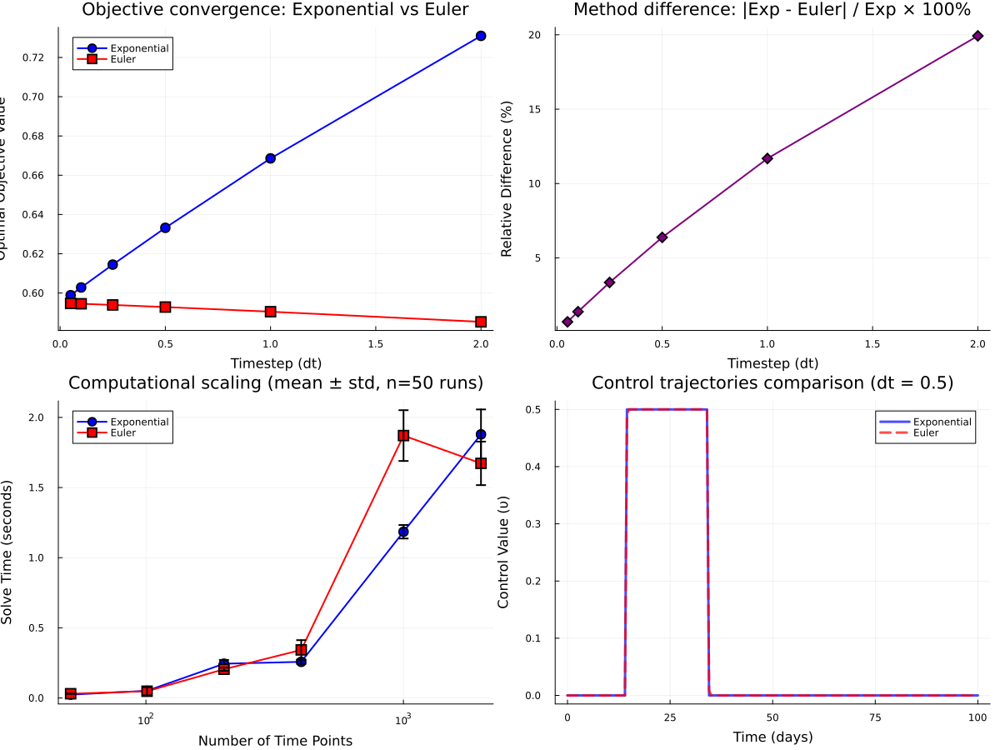

# Timestep sensitivity analysis: Exponential vs Euler discretisation
Sandra Montes (@slmontes)
2026-01-20

## Introduction

This script performs a timestep sensitivity analysis for Case Scenario 1
(lockdown) comparing two discretisation methods:

**Method 1: Exponential discretisation**

- `infection[t] == (1 - exp(-(1 - υ[t]) * β * I[t] * dt)) * S[t]`
- `recovery[t] == (1 - exp(-γ * dt)) * I[t]`

**Method 2: Simple Euler discretisation**

- `infection[t] == (1 - υ[t]) * β * I[t] * dt * S[t]`
- `recovery[t] == γ * dt * I[t]`

``` julia
using JuMP
using Ipopt
using Plots
Plots.default(fmt = :png)   # or :svg
using DataFrames
using Statistics
```

We add a warmup step to trigger JIT compilation and eliminate
compilation overhead time

``` julia
function warmup_jit()
    warmup_model = Model(Ipopt.Optimizer)
    set_optimizer_attribute(warmup_model, "print_level", 0)  # Silent
    
    # Small test problem
    @variable(warmup_model, 0 <= x[1:5] <= 1)
    @variable(warmup_model, y[1:4] >= 0)
    @constraint(warmup_model, [t=1:4], y[t] == (1 - exp(-0.5 * x[t])) * x[t])
    @constraint(warmup_model, [t=1:4], x[t+1] == x[t] - y[t])
    @objective(warmup_model, Min, x[5])
    
    optimize!(warmup_model)
end
warmup_jit()
```

Model parameters

``` julia
β = 0.5         # infection rate
γ = 0.25        # recovery rate
υ_max = 0.5     # maximum intervention
υ_total = 10.0  # maximum cost

t0 = 0.0
tf = 100.0

S0 = 0.99
I0 = 0.01
C0 = 0.00;
```

``` julia
# Timesteps to test
dt_values = [2.0, 1.0, 0.5, 0.25, 0.1, 0.05]

# Number of repetitions per dt cases (to calculate mean and std)
n_repetitions = 50

# Initialise results storage
results_exponential = []
results_euler = [];
```

Running optimisation for each timestep on both methods:

### Method 1: Exponential discretisation

``` julia
for dt in dt_values
    
    # Number of time points
    T = Int(tf/dt)

    # Storage results
    solve_times_exp = []
    objectives_exp = []
    statuses_exp = []
    
    # Trajectories 
    local υ_opt_exp, C_opt_exp, S_opt_exp, I_opt_exp
    
    # Run n_repetitions times
    for rep in 1:n_repetitions
        model_exp = Model(Ipopt.Optimizer)
        set_optimizer_attribute(model_exp, "print_level", 0)  
        
        # Variables
        @variable(model_exp, 0 <= S[1:(T+1)] <= 1)
        @variable(model_exp, 0 <= I[1:(T+1)] <= 1)
        @variable(model_exp, 0 <= C[1:(T+1)] <= 1)
        @variable(model_exp, 0 <= υ[1:(T+1)] <= υ_max)
        
        # Exponential discretisation
        @expressions(model_exp, begin
            infection[t in 1:T], (1 - exp(-(1 - υ[t]) * β * I[t] * dt)) * S[t]
            recovery[t in 1:T], (1 - exp(-γ * dt)) * I[t]
        end)

        @constraints(model_exp, begin
            S[1]==S0
            I[1]==I0
            C[1]==C0
            [t=1:T], S[t+1] == S[t] - infection[t]
            [t=1:T], I[t+1] == I[t] + infection[t] - recovery[t]
            [t=1:T], C[t+1] == C[t] + infection[t]
            dt * sum(υ[t] for t in 1:T+1) <= υ_total
        end)
        
        # Objective
        @objective(model_exp, Min, C[T+1])
        
        # Solve and time
        solve_start = time()
        optimize!(model_exp)
        solve_time = time() - solve_start
        
        # Extract results
        status = termination_status(model_exp)
        obj_value = objective_value(model_exp)
        
        # Store results
        push!(solve_times_exp, solve_time)
        push!(objectives_exp, obj_value)
        push!(statuses_exp, status)
        
        # Save trajectories from first run
        if rep == 1
            υ_opt_exp = value.(υ)
            C_opt_exp = value.(C)
            S_opt_exp = value.(S)
            I_opt_exp = value.(I)
        end
    end
    
    # Results
    mean_time_exp = mean(solve_times_exp)
    std_time_exp = std(solve_times_exp)
    
    # Verify ALL runs converged successfully
    if !all(s == MOI.LOCALLY_SOLVED for s in statuses_exp)
        error("Not all Exponential runs converged! Statuses: $statuses_exp")
    end
    status_exp = statuses_exp[1]  # All LOCALLY_SOLVED

    # Verify that all objectives are identical
    if !all(abs(obj - objectives_exp[1]) < 1e-10 for obj in objectives_exp)
        error("Objectives varied across repetitions:\n" *
              "  Values: $objectives_exp\n" *
              "  Max difference: $(maximum(objectives_exp) - minimum(objectives_exp))")
    end
    obj_value_exp = objectives_exp[1]  
    
    # Control 
    threshold = 0.01
    control_start_idx = findfirst(x -> x > threshold, υ_opt_exp)
    control_start_exp = control_start_idx !== nothing ? (control_start_idx - 1) * dt : nothing
    control_active = [υ_opt_exp[i] > threshold for i in 1:length(υ_opt_exp)]
    control_duration_exp = sum(control_active) * dt
    
    # Exponential results
    result_exp = Dict(
        :dt => dt,
        :method => "Exponential",
        :time_points => T+1,
        :objective => obj_value_exp,
        :solve_time => mean_time_exp,
        :solve_time_std => std_time_exp,
        :solve_times_all => solve_times_exp,
        :convergence => string(status_exp),
        :control_start => control_start_exp,
        :control_duration => control_duration_exp,
        :final_infections => C_opt_exp[end],
        :υ_trajectory => υ_opt_exp,
        :C_trajectory => C_opt_exp,
        :S_trajectory => S_opt_exp,
        :I_trajectory => I_opt_exp
    )
    push!(results_exponential, result_exp)
end
```

## Method 2: Simple Euler discretisation (Linear approximation)

``` julia
for dt in dt_values
    
    # Number of time points
    T = Int(tf/dt)
    
    # Storage results
    solve_times_euler = [] 
    objectives_euler = []
    statuses_euler = []
    
    # Trajectories 
    local υ_opt_euler, C_opt_euler, S_opt_euler, I_opt_euler
    
    # Run n_repetitions times
    for rep in 1:n_repetitions
        model_euler = Model(Ipopt.Optimizer)
        set_optimizer_attribute(model_euler, "print_level", 0)  
        
        # Variables
        @variable(model_euler, 0 <= S[1:(T+1)] <= 1)
        @variable(model_euler, 0 <= I[1:(T+1)] <= 1)
        @variable(model_euler, 0 <= C[1:(T+1)] <= 1)
        @variable(model_euler, 0 <= υ[1:(T+1)] <= υ_max)
        
        # Simple Euler discretisation
        @expressions(model_euler, begin
            infection[t in 1:T], (1 - υ[t]) * β * I[t] * dt * S[t]
            recovery[t in 1:T], γ * dt * I[t]
        end)

        @constraints(model_euler, begin
            S[1]==S0
            I[1]==I0
            C[1]==C0
            [t=1:T], S[t+1] == S[t] - infection[t]
            [t=1:T], I[t+1] == I[t] + infection[t] - recovery[t]
            [t=1:T], C[t+1] == C[t] + infection[t]
            dt * sum(υ[t] for t in 1:T+1) <= υ_total
        end)
        
        # Objective
        @objective(model_euler, Min, C[T+1])
        
        # Solve and time
        solve_start = time()
        optimize!(model_euler)
        solve_time = time() - solve_start
        
        # Extract results
        status = termination_status(model_euler)
        obj_value = objective_value(model_euler)
        
        # Store results
        push!(solve_times_euler, solve_time)
        push!(objectives_euler, obj_value)
        push!(statuses_euler, status)
        
        # Save trajectories from first run
        if rep == 1
            υ_opt_euler = value.(υ)
            C_opt_euler = value.(C)
            S_opt_euler = value.(S)
            I_opt_euler = value.(I)
        end
    end
    
    # Calculate statistics
    mean_time_euler = mean(solve_times_euler)
    std_time_euler = std(solve_times_euler)
    
    # Verify ALL runs converged successfully
    if !all(s == MOI.LOCALLY_SOLVED for s in statuses_euler)
        error("Not all Euler runs converged! Statuses: $statuses_euler")
    end
    status_euler = statuses_euler[1]  

    # Verify all objectives are identical
    if !all(abs(obj - objectives_euler[1]) < 1e-10 for obj in objectives_euler)
        error("Objectives varied across repetitions:\n" *
              "  Values: $objectives_euler\n" *
              "  Max difference: $(maximum(objectives_euler) - minimum(objectives_euler))")
    end
    obj_value_euler = objectives_euler[1]  
    
    # Control 
    threshold = 0.01
    control_start_idx = findfirst(x -> x > threshold, υ_opt_euler)
    control_start_euler = control_start_idx !== nothing ? (control_start_idx - 1) * dt : nothing
    control_active = [υ_opt_euler[i] > threshold for i in 1:length(υ_opt_euler)]
    control_duration_euler = sum(control_active) * dt
    
    # Verify all objectives are identical
    if !all(abs(obj - objectives_euler[1]) < 1e-10 for obj in objectives_euler)
        error("Euler: Not deterministic! Objectives varied across repetitions:\n" *
              "  Values: $objectives_euler\n" *
              "  Max difference: $(maximum(objectives_euler) - minimum(objectives_euler))")
    end
    
    # Euler results
    result_euler = Dict(
        :dt => dt,
        :method => "Euler",
        :time_points => T+1,
        :objective => obj_value_euler,
        :solve_time => mean_time_euler,
        :solve_time_std => std_time_euler,
        :solve_times_all => solve_times_euler,
        :convergence => string(status_euler),
        :control_start => control_start_euler,
        :control_duration => control_duration_euler,
        :final_infections => C_opt_euler[end],
        :υ_trajectory => υ_opt_euler,
        :C_trajectory => C_opt_euler,
        :S_trajectory => S_opt_euler,
        :I_trajectory => I_opt_euler
    )
    push!(results_euler, result_euler)
end
```

Exponential discretisation results:

    6×9 DataFrame
     Row │ dt       time_points  objective  solve_time_mean  solve_time_std  convergence     control_start  control_duration  final_infections 
         │ Float64  Float64      Float64    Float64          Float64         String          Float64        Float64           Float64          
    ─────┼─────────────────────────────────────────────────────────────────────────────────────────────────────────────────────────────────────
       1 │    2.0          51.0     0.731            0.0235          0.0052  LOCALLY_SOLVED          16.0              20.0             0.731
       2 │    1.0         101.0     0.6686           0.0513          0.0079  LOCALLY_SOLVED          15.0              20.0             0.6686
       3 │    0.5         201.0     0.6332           0.2441          0.027   LOCALLY_SOLVED          14.5              20.0             0.6332
       4 │    0.25        401.0     0.6145           0.2575          0.0146  LOCALLY_SOLVED          14.25             20.25            0.6145
       5 │    0.1        1001.0     0.6028           1.1848          0.0481  LOCALLY_SOLVED          14.2              20.1             0.6028
       6 │    0.05       2001.0     0.5989           1.879           0.1777  LOCALLY_SOLVED          14.2              20.0             0.5989

Simple Euler discretisation results:

    6×9 DataFrame
     Row │ dt       time_points  objective  solve_time_mean  solve_time_std  convergence     control_start  control_duration  final_infections 
         │ Float64  Float64      Float64    Float64          Float64         String          Float64        Float64           Float64          
    ─────┼─────────────────────────────────────────────────────────────────────────────────────────────────────────────────────────────────────
       1 │    2.0          51.0     0.5853           0.0302          0.0006  LOCALLY_SOLVED          16.0              20.0             0.5853
       2 │    1.0         101.0     0.5905           0.0481          0.0289  LOCALLY_SOLVED          15.0              20.0             0.5905
       3 │    0.5         201.0     0.5928           0.2049          0.0114  LOCALLY_SOLVED          14.5              20.0             0.5928
       4 │    0.25        401.0     0.5939           0.3425          0.0697  LOCALLY_SOLVED          14.25             20.25            0.5939
       5 │    0.1        1001.0     0.5945           1.8703          0.181   LOCALLY_SOLVED          14.2              20.1             0.5945
       6 │    0.05       2001.0     0.5947           1.6722          0.1551  LOCALLY_SOLVED          14.2              20.05            0.5947

Relative errors of each method using ‘dt=0.05’ as reference

``` julia
ref_idx_exp = findfirst(r -> r[:dt] == 0.05, results_exponential)
ref_idx_euler = findfirst(r -> r[:dt] == 0.05, results_euler)

if ref_idx_exp !== nothing && ref_idx_euler !== nothing
    ref_obj_exp = results_exponential[ref_idx_exp][:objective]
    ref_obj_euler = results_euler[ref_idx_euler][:objective]
     
    # Exponential method
    rel_errors_exp = []
    for r in results_exponential
        obj_error = abs(r[:objective] - ref_obj_exp) / ref_obj_exp * 100
        push!(rel_errors_exp, Dict(
            :dt => r[:dt],
            :obj_rel_error_pct => obj_error,
            :method => "Exponential"
        ))
    end
    
    # Euler method
    rel_errors_euler = []
    for r in results_euler
        obj_error = abs(r[:objective] - ref_obj_euler) / ref_obj_euler * 100
        push!(rel_errors_euler, Dict(
            :dt => r[:dt],
            :obj_rel_error_pct => obj_error,
            :method => "Euler"
        ))
    end
    
    errors_exp_df = DataFrame(rel_errors_exp)
    errors_euler_df = DataFrame(rel_errors_euler)
    
    # Convergence table
    convergence_comparison_df = DataFrame(
        dt = [r[:dt] for r in results_exponential],
        exp_error_pct = [r[:obj_rel_error_pct] for r in rel_errors_exp],
        euler_error_pct = [r[:obj_rel_error_pct] for r in rel_errors_euler]
    )
    
    show(transform(convergence_comparison_df, names(convergence_comparison_df, Real) .=> (x -> round.(x, digits=4)) .=> names(convergence_comparison_df, Real)), allrows=true, allcols=true)
    
end
```

    6×3 DataFrame
     Row │ dt       exp_error_pct  euler_error_pct 
         │ Float64  Float64        Float64         
    ─────┼─────────────────────────────────────────
       1 │    2.0         22.0589           1.5812
       2 │    1.0         11.6362           0.7131
       3 │    0.5          5.7315           0.3145
       4 │    0.25         2.6017           0.1343
       5 │    0.1          0.6581           0.0335
       6 │    0.05         0.0              0.0

### Plots


