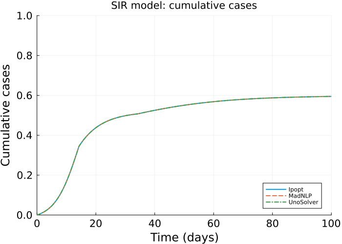
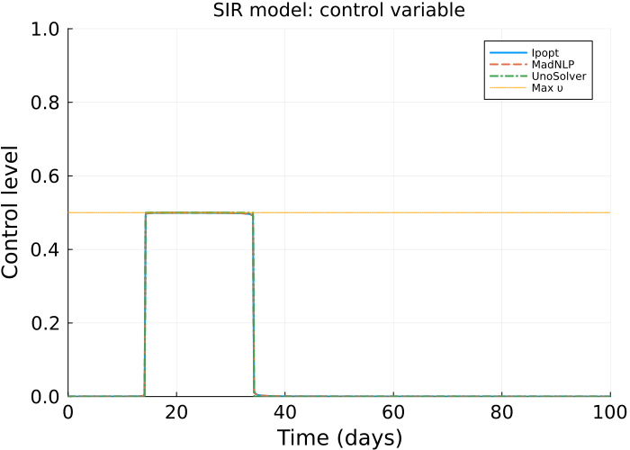
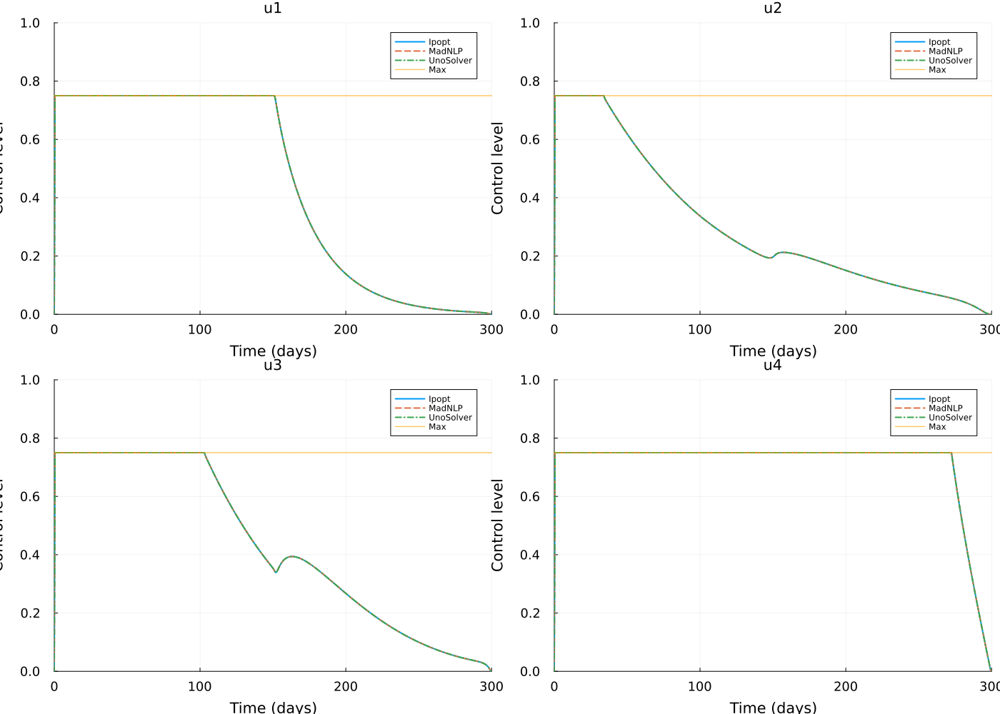

# Solver comparison on lockdown optimisation case scenario using JuMP.jl
Simon Frost (@sdwfrost) and Sandra Montes (@slmontes)
2026-01-10

## Introduction

This example explores the optimal control of an SIR
(Susceptible-Infected-Recovered) model using a time-varying intervention
that reduces the infection rate. The population is divided into three
categories: susceptible individuals (`S`), infected individuals (`I`),
and the total number of cases (`C`). The intervention is modelled as a
time-dependent control variable `υ(t)` that reduces the transmission
rate by a factor of `1 - υ(t)`. The goal is to determine the optimal
timing and application of this intervention to minimise the final number
of cases (`C`) under the following constraints: (a) `υ` cannot exceed a
maximum value, and (b) the total cost, measured as the integral of `υ`
over time, must remain within a specified limit.

The model is described by the following differential equations:

$$
\begin{aligned}
\dfrac{\mathrm{d}S}{\mathrm{dt}} &= -\beta (1 - \upsilon(t)) S I, \\
\dfrac{\mathrm{d}I}{\mathrm{dt}} &= \beta (1 - \upsilon(t)) S I - \gamma I, \\
\dfrac{\mathrm{d}C}{\mathrm{dt}} &= \beta (1 - \upsilon(t)) S I,
\end{aligned}
$$

Here, `β` is the transmission rate, and `γ` is the recovery rate.

In a study by [Britton and Leskela
(2022)](https://epubs.siam.org/doi/10.1137/22M1504433), it was
demonstrated that the optimal strategy for controlling the epidemic
under the above model involves a single lockdown at a set maximum
intervention level for `υ`, sustained until the cost reaches the
specified threshold. To determine whether the optimal policy can be
identified numerically, we use a simple Euler discretisation and then
use JuMP.jl to formulate the optimisation problem.

We compare three nonlinear programming solvers—Ipopt, MadNLP, and
UnoSolver—to assess their performance in terms of solution, convergence,
and computational efficiency.

## Libraries

``` julia
using OrdinaryDiffEq
using DiffEqCallbacks
using JuMP
using Ipopt
using MadNLP
using UnoSolver
using Plots
Plots.default(fmt = :png)   # or :svg
using Measures
using DataInterpolations
using NonlinearSolve
using BenchmarkTools
using DataFrames
using Printf
using Statistics;
```

## Parameters

``` julia
β = 0.5
γ = 0.25
υ_max = 0.5
υ_total = 10.0
S0 = 0.99
I0 = 0.01
C0 = 0.0
t0 = 0.0
tf = 100.0
dt = 0.1
T = Int(tf/dt)
ts = [t0 + i*dt for i in 0:T]
```

## Methods

We discretise the NLP problem using Euler’s method with a time step of
`dt = 0.1` over the time horizon `[0, 100]` days, resulting in
`T = 1000` time steps. The optimisation problem is formulated using
JuMP.jl, with the objective of minimising the final cumulative cases
`C[T+1]` subject to the discretised ODE constraints and the cost
constraint on the total intervention.

## Solver Configuration

To ensure a fair comparison, we set consistent tolerances, iteration
limits, and time limits across all solvers. All solvers are configured
with a convergence tolerance of `1e-6`, a constraint violation tolerance
of `1e-6`, a maximum iteration limit of 10,000, and a time limit of
1,800 seconds (30 minutes).

``` julia
# Common solver settings
const COMMON_TOL = 1e-6           # Convergence tolerance
const COMMON_CONSTR_TOL = 1e-6    # Constraint violation tolerance
const COMMON_MAX_ITER = 10000     # Maximum iterations
const COMMON_TIME_LIMIT = (600.0*3)   # Time limit in seconds (30 minutes)

# Benchmarking settings
n_samples_sir = 5             # Samples for benchmarking
n_sec_sir = 60                # Seconds to run the benchmark per sample
n_samples_dengue = 5          # Samples for benchmarking
n_sec_dengue = 300            # Seconds to run the benchmark per sample

function configure_solver!(model, solver_type::Symbol)
    set_silent(model)

    if solver_type == :Ipopt
        set_optimizer_attribute(model, "tol", COMMON_TOL)
        set_optimizer_attribute(model, "constr_viol_tol", COMMON_CONSTR_TOL)
        set_optimizer_attribute(model, "max_iter", COMMON_MAX_ITER)
        set_optimizer_attribute(model, "max_wall_time", COMMON_TIME_LIMIT)
        set_optimizer_attribute(model, "warm_start_init_point", "no")
    elseif solver_type == :MadNLP
        set_optimizer_attribute(model, "tol", COMMON_TOL)
        set_optimizer_attribute(model, "constr_viol_tol", COMMON_CONSTR_TOL)
        set_optimizer_attribute(model, "max_iter", COMMON_MAX_ITER)
        set_optimizer_attribute(model, "max_wall_time", COMMON_TIME_LIMIT)
    elseif solver_type == :UnoSolver
        set_optimizer_attribute(model, "tolerance", COMMON_TOL)
        set_optimizer_attribute(model, "max_iterations", COMMON_MAX_ITER)
        set_optimizer_attribute(model, "time_limit", COMMON_TIME_LIMIT)
    end

    return model
end
```

## SIR Model Optimisation

We solve the SIR optimal control problem using each of the three
solvers. For each solver, we benchmark the optimisation time and record
the objective value and termination status. All benchmarks use the same
number of samples (5) to ensure fair comparison. As benchmark times can
vary between runs due to diverse factors such as system load and
background processes; the standard deviation quantifies the variability
within a single benchmark run across the samples.

``` julia
function optimize_model(opt, solver_type::Symbol)
    model = Model(opt)

    # Apply consistent solver configuration
    configure_solver!(model, solver_type)

    # Variables
    @variable(model, 0 <= S[1:(T+1)] <= 1)
    @variable(model, 0 <= I[1:(T+1)] <= 1)
    @variable(model, 0 <= C[1:(T+1)] <= 1)
    @variable(model, 0 <= υ[1:(T+1)] <= υ_max)

    @expressions(model, begin
        infection[t in 1:T], (1 - υ[t]) * β * I[t] * dt * S[t]  # Linear approximation of infection rate
        recovery[t in 1:T], γ * dt * I[t] # Recoveries at each time step
    end)

    @constraints(model, begin
        S[1]==S0
        I[1]==I0
        C[1]==C0
        [t=1:T], S[t+1] == S[t] - infection[t]
        [t=1:T], I[t+1] == I[t] + infection[t] - recovery[t]
        [t=1:T], C[t+1] == C[t] + infection[t]
        dt * sum(υ[t] for t in 1:T+1) <= υ_total
    end)

    # Set consistent starting values for all solvers
    set_start_value.(S, S0)
    set_start_value.(I, I0)
    set_start_value.(C, C0)
    set_start_value.(υ, 0.0)

    @objective(model, Min, C[T+1])

    optimize!(model)
    return model
end
```

``` julia
ipopt_bench = @benchmark ipopt_model = optimize_model(Ipopt.Optimizer, :Ipopt) samples=n_samples_sir seconds=n_sec_sir
```

    BenchmarkTools.Trial: 5 samples with 1 evaluation per sample.
     Range (min … max):  1.330 s …   1.433 s  ┊ GC (min … max): 0.00% … 0.00%
     Time  (median):     1.351 s              ┊ GC (median):    0.00%
     Time  (mean ± σ):   1.366 s ± 40.440 ms  ┊ GC (mean ± σ):  0.00% ± 0.00%

      █       █  █         █                                  █  
      █▁▁▁▁▁▁▁█▁▁█▁▁▁▁▁▁▁▁▁█▁▁▁▁▁▁▁▁▁▁▁▁▁▁▁▁▁▁▁▁▁▁▁▁▁▁▁▁▁▁▁▁▁▁█ ▁
      1.33 s         Histogram: frequency by time        1.43 s <

     Memory estimate: 86.02 MiB, allocs estimate: 1547823.

``` julia
ipopt_time = round(mean(ipopt_bench.times) / 1e9, digits=4)  # Convert from nanoseconds to seconds
ipopt_time_std = round(std(ipopt_bench.times) / 1e9, digits=4)  # Standard deviation in seconds
```

``` julia
ipopt_model = optimize_model(Ipopt.Optimizer, :Ipopt)
ipopt_obj = objective_value(ipopt_model)
ipopt_status = termination_status(ipopt_model)
```

    LOCALLY_SOLVED::TerminationStatusCode = 4

``` julia
madnlp_bench = @benchmark madnlp_model = optimize_model(MadNLP.Optimizer, :MadNLP) samples=n_samples_sir seconds=n_sec_sir
```

    BenchmarkTools.Trial: 5 samples with 1 evaluation per sample.
     Range (min … max):  1.376 s …   1.488 s  ┊ GC (min … max):  9.75% … 12.00%
     Time  (median):     1.454 s              ┊ GC (median):    11.93%
     Time  (mean ± σ):   1.445 s ± 42.077 ms  ┊ GC (mean ± σ):  11.53% ±  1.00%

      █                                 █    █    █           █  
      █▁▁▁▁▁▁▁▁▁▁▁▁▁▁▁▁▁▁▁▁▁▁▁▁▁▁▁▁▁▁▁▁▁█▁▁▁▁█▁▁▁▁█▁▁▁▁▁▁▁▁▁▁▁█ ▁
      1.38 s         Histogram: frequency by time        1.49 s <

     Memory estimate: 7.82 GiB, allocs estimate: 1947815.

``` julia
madnlp_time = round(mean(madnlp_bench.times) / 1e9, digits=4)
madnlp_time_std = round(std(madnlp_bench.times) / 1e9, digits=4)
```

``` julia
madnlp_model = optimize_model(MadNLP.Optimizer, :MadNLP)
madnlp_obj = objective_value(madnlp_model)
madnlp_status = termination_status(madnlp_model)
```

    LOCALLY_SOLVED::TerminationStatusCode = 4

``` julia
uno_bench = @benchmark uno_model = optimize_model(() -> UnoSolver.Optimizer(preset="ipopt"), :UnoSolver) samples=n_samples_sir seconds=n_sec_sir
```

    BenchmarkTools.Trial: 5 samples with 1 evaluation per sample.
     Range (min … max):  1.648 s …   1.780 s  ┊ GC (min … max): 0.00% … 0.00%
     Time  (median):     1.662 s              ┊ GC (median):    0.00%
     Time  (mean ± σ):   1.683 s ± 54.603 ms  ┊ GC (mean ± σ):  0.00% ± 0.00%

      █   █ ██                                                █  
      █▁▁▁█▁██▁▁▁▁▁▁▁▁▁▁▁▁▁▁▁▁▁▁▁▁▁▁▁▁▁▁▁▁▁▁▁▁▁▁▁▁▁▁▁▁▁▁▁▁▁▁▁▁█ ▁
      1.65 s         Histogram: frequency by time        1.78 s <

     Memory estimate: 85.99 MiB, allocs estimate: 1537605.

``` julia
uno_time = round(mean(uno_bench.times) / 1e9, digits=4)
uno_time_std = round(std(uno_bench.times) / 1e9, digits=4)
```

``` julia
uno_model = optimize_model(() -> UnoSolver.Optimizer(preset="ipopt"), :UnoSolver)
uno_obj = objective_value(uno_model)
uno_status = termination_status(uno_model)
```

    LOCALLY_SOLVED::TerminationStatusCode = 4

### Results Summary

``` julia
# Create summary table
sir_results = DataFrame(
    Solver = ["Ipopt", "MadNLP", "UnoSolver"],
    Objective_Value = [ipopt_obj, madnlp_obj, uno_obj],
    Solve_Time_s = [ipopt_time, madnlp_time, uno_time],
    Solve_Time_std_s = [ipopt_time_std, madnlp_time_std, uno_time_std],
    Status = [string(ipopt_status), string(madnlp_status), string(uno_status)]
)

# Format for display
sir_results_formatted = DataFrame(
    Solver = sir_results.Solver,
    Objective_Value = [@sprintf("%.6f", x) for x in sir_results.Objective_Value],
    Solve_Time_s = [@sprintf("%.4f", x) for x in sir_results.Solve_Time_s],
    Solve_Time_std_s = [@sprintf("%.4f", x) for x in sir_results.Solve_Time_std_s],
    Status = sir_results.Status
)

println("SIR Model - Solver Comparison Results:")
println(" ")
sir_results_formatted
```

    SIR Model - Solver Comparison Results:
     

### Trajectory Comparison

``` julia
# Create comparison plot with better formatting
p1 = plot(title="SIR model: cumulative cases", 
          xlabel="Time (days)", 
          ylabel="Cumulative cases", 
          ylim=(0,1),
          xlim=(0,100),
          legend=:bottomright,
          size=(700, 500),
          dpi=300,
          xtickfontsize=14, ytickfontsize=14,
          xguidefontsize=16, yguidefontsize=16,
          right_margin=10pt)
plot!(p1, ts, value.(ipopt_model.obj_dict[:C]), label="Ipopt", linewidth=2, linestyle=:solid)
plot!(p1, ts, value.(madnlp_model.obj_dict[:C]), label="MadNLP", linewidth=2, linestyle=:dash)
plot!(p1, ts, value.(uno_model.obj_dict[:C]), label="UnoSolver", linewidth=2, linestyle=:dashdot)
p1
```



``` julia
# Plot control variable comparison
p2 = plot(title="SIR model: control variable", 
          xlabel="Time (days)", 
          ylabel="Control level",
          ylim=(0,1),
          xlim=(0,100),
          legend=:topright,
          size=(700, 500),
          dpi=300,
          xtickfontsize=14, ytickfontsize=14,
          xguidefontsize=16, yguidefontsize=16,
          right_margin=10pt)
plot!(p2, ts, value.(ipopt_model.obj_dict[:υ]), label="Ipopt", linewidth=2, linestyle=:solid)
plot!(p2, ts, value.(madnlp_model.obj_dict[:υ]), label="MadNLP", linewidth=2, linestyle=:dash)
plot!(p2, ts, value.(uno_model.obj_dict[:υ]), label="UnoSolver", linewidth=2, linestyle=:dashdot)
plot!(p2, ts, fill(υ_max, length(ts)), color=:orange, alpha=0.7, label="Max υ", linewidth=1.5, linestyle=:dot)
p2
```



## Dengue Model Comparison

To assess solver performance on more complex problems, we also test a
Dengue transmission model with multiple states and controls. This model
includes seven state variables (susceptible humans `S_h`, symptomatic
infected humans `I_h`, asymptomatic carriers `I_hA`, partially immune
individuals `P`, recovered humans `R_h`, susceptible mosquitoes `S_v`,
and infected mosquitoes `I_v`) and four control variables (treated
bednets `u1`, vaccination `u2`, treatment `u3`, and insecticides `u4`).
The objective function minimises a weighted combination of infected
populations and control costs over a 300-day time horizon with a time
step of `dt = 0.5` days.

``` julia
function optimize_dengue(opt, solver_type::Symbol; u1_max=0.75, u2_max=0.75, u3_max=0.75, u4_max=0.75)

    # Model definition
    model = Model(opt)

    # Apply consistent solver configuration
    configure_solver!(model, solver_type)

    u1_init = 0
    u2_init = 0
    u3_init = 0
    u4_init = 0

    t0 = 0.0
    tf = 300.0
    dt = 0.5
    ts = collect(0:dt:tf)

    S_h0 = 10000
    I_h0 = 100
    I_hA0 = 500
    P0 = 100
    R_h0 = 1000
    S_v0 = 6000
    I_v0 = 600
    beta_1 = 0.75   # Transmission prob from I_v to S_h
    beta_2 = 0.375  # Transmission prob from I_h to S_v
    beta_3 = 0.75   # Transmission prb from I_v to P
    b =  0.5        # Avg bitting rate per mosquito per person
    rho = 0.01      # Proportion of treated individuals with partial immunity
    psi = 0.4       # Proportion of incidence rate from S_h to I_h
    gamma_h = 0.3288330  # Disease related death rate of humans
    omega = 0.54    # Proportion of incidence rate from P to I_h
    mu_h = 0.0045   # Natural mortality rate and recruitment rate of humans
    mu_v = 0.0323   # Natural mortality rate and recruitment rate of vector
    phi = 0.48      # Proportion of natural Recovery
    r_0 = 0.005     # Enhance death rate

    # Weights for the objective function
    C_1 = 5
    C_2 = 5
    C_3 = 5
    D_1 = 16.62
    D_2 = 2.5
    D_3 = 5
    D_4 = 16.62
    δ = 0.001
    T = Int(tf/dt)

    @variable(model, S_h[1:(T+1)] >= 0)     # Susceptible humans
    @variable(model, I_h[1:(T+1)] >= 0)     # Infected symptomatic
    @variable(model, I_hA[1:(T+1)] >= 0)    # Carriers asymptomatic
    @variable(model, P[1:(T+1)] >= 0)       # Partially immune
    @variable(model, R_h[1:(T+1)] >= 0)     # Recovered humans
    @variable(model, S_v[1:(T+1)] >= 0)     # Susceptible mosquitoes
    @variable(model, I_v[1:(T+1)] >= 0)     # Infected mosquitoes

    @variable(model, 0 <= u1[1:(T+1)] <= u1_max)   # Treated bednet
    @variable(model, 0 <= u2[1:(T+1)] <= u2_max)   # Vaccination
    @variable(model, 0 <= u3[1:(T+1)] <= u3_max)   # Treatment (prophylactics)
    @variable(model, 0 <= u4[1:(T+1)] <= u4_max)   # Insecticides

    # Set consistent starting values for all solvers
    set_start_value.(S_h, S_h0)
    set_start_value.(I_h, I_h0)
    set_start_value.(I_hA, I_hA0)
    set_start_value.(P, P0)
    set_start_value.(R_h, R_h0)
    set_start_value.(S_v, S_v0)
    set_start_value.(I_v, I_v0)
    set_start_value.(u1, u1_init)
    set_start_value.(u2, u2_init)
    set_start_value.(u3, u3_init)
    set_start_value.(u4, u4_init)

    # Initial conditions
    @constraints(model, begin
        S_h[1] == S_h0
        I_h[1] == I_h0
        I_hA[1] == I_hA0
        P[1] == P0
        R_h[1] == R_h0
        S_v[1] == S_v0
        I_v[1] == I_v0
        u1[1] == u1_init
        u2[1] == u2_init
        u3[1] == u3_init
        u4[1] == u4_init
        [t=[T+1]], u1[t] == u1[t-1]
        [t=[T+1]], u2[t] == u2[t-1]
        [t=[T+1]], u3[t] == u3[t-1]
        [t=[T+1]], u4[t] == u4[t-1]
    end)

    # Population sizes and infection rates
    @expressions(model, begin
        N_h[t=1:T], (S_h[t] + I_h[t] + I_hA[t] + P[t] + R_h[t])
        N_v[t=1:T], (S_v[t] + I_v[t])
        lambda_h[t=1:T], ((1 - u1[t]) * b * beta_1 / N_h[t]) * I_v[t]
        lambda_h1[t=1:T], ((1 - u1[t]) * b * beta_2 / N_h[t]) * I_v[t]
        lambda_v[t=1:T], (b * beta_3 / N_h[t]) * (I_h[t] + I_hA[t])
    end)

    # ODEs
    @constraints(model, begin
        [t=1:T], S_h[t+1] == S_h[t] + (mu_h * N_h[t] - lambda_h[t] * S_h[t] - S_h[t] * u2[t] - mu_h * S_h[t]) * dt
        [t=1:T], I_h[t+1] == I_h[t] + (psi * lambda_h[t] * S_h[t] + omega * lambda_h1[t] * P[t] - (mu_h + u3[t] + gamma_h) * I_h[t]) * dt
        [t=1:T], I_hA[t+1] == I_hA[t] + ((1 - psi) * lambda_h[t] * S_h[t] + (1 - omega) * lambda_h1[t] * P[t] - (mu_h + gamma_h) * I_hA[t]) * dt
        [t=1:T], P[t+1] == P[t] + (u2[t] * S_h[t] + rho * u3[t] * I_h[t] + phi * gamma_h * (I_h[t] + I_hA[t]) - lambda_h1[t] * P[t] - mu_h * P[t]) * dt
        [t=1:T], R_h[t+1] == R_h[t] + ((1 - rho) * u3[t] * I_h[t] + (1 - phi) * gamma_h * (I_h[t] + I_hA[t]) - mu_h * R_h[t]) * dt
        [t=1:T], S_v[t+1] == S_v[t] + (mu_v * N_v[t] * (1 - u4[t]) - lambda_v[t] * S_v[t] - mu_v * S_v[t] - r_0 * u4[t] * S_v[t]) * dt
        [t=1:T], I_v[t+1] == I_v[t] + (lambda_v[t] * S_v[t] - mu_v * I_v[t] - r_0 * u4[t] * I_v[t]) * dt
    end)

    # Objective function
    @objective(model, Min, sum(
        C_1 * I_h[t] + C_2 * I_hA[t] + C_3 * (S_v[t] + I_v[t]) + (D_1 * u1[t]^2)/2 + (D_2 * u2[t]^2)/2 + (D_3 * u3[t]^2)/2 + (D_4 * u4[t]^2)/2
        for t in 1:T
    ))

    # Run optimisation
    optimize!(model)
    return model
end
```

``` julia
ipopt_dengue_bench = @benchmark ipopt_dengue_model = optimize_dengue(Ipopt.Optimizer, :Ipopt) samples=n_samples_dengue seconds=n_sec_dengue
```

    BenchmarkTools.Trial: 5 samples with 1 evaluation per sample.
     Range (min … max):  26.184 s … 29.381 s  ┊ GC (min … max): 0.00% … 0.19%
     Time  (median):     27.769 s             ┊ GC (median):    0.20%
     Time  (mean ± σ):   27.732 s ±  1.363 s  ┊ GC (mean ± σ):  0.18% ± 0.17%

      █      █                    █                █          █  
      █▁▁▁▁▁▁█▁▁▁▁▁▁▁▁▁▁▁▁▁▁▁▁▁▁▁▁█▁▁▁▁▁▁▁▁▁▁▁▁▁▁▁▁█▁▁▁▁▁▁▁▁▁▁█ ▁
      26.2 s         Histogram: frequency by time        29.4 s <

     Memory estimate: 296.96 MiB, allocs estimate: 4961699.

``` julia
ipopt_dengue_time = round(mean(ipopt_dengue_bench.times) / 1e9, digits=4)
ipopt_dengue_time_std = round(std(ipopt_dengue_bench.times) / 1e9, digits=4)
```

``` julia
ipopt_dengue_model = optimize_dengue(Ipopt.Optimizer, :Ipopt)
ipopt_dengue_obj = objective_value(ipopt_dengue_model)
ipopt_dengue_status = termination_status(ipopt_dengue_model)
```

    LOCALLY_SOLVED::TerminationStatusCode = 4

``` julia
madnlp_dengue_bench = @benchmark madnlp_dengue_model = optimize_dengue(MadNLP.Optimizer, :MadNLP) samples=n_samples_dengue seconds=n_sec_dengue
```

    BenchmarkTools.Trial: 5 samples with 1 evaluation per sample.
     Range (min … max):  41.190 s … 45.632 s  ┊ GC (min … max): 1.41% … 1.25%
     Time  (median):     44.990 s             ┊ GC (median):    1.40%
     Time  (mean ± σ):   44.141 s ±  1.893 s  ┊ GC (mean ± σ):  1.63% ± 0.38%

      ▁                          ▁                    ▁       █  
      █▁▁▁▁▁▁▁▁▁▁▁▁▁▁▁▁▁▁▁▁▁▁▁▁▁▁█▁▁▁▁▁▁▁▁▁▁▁▁▁▁▁▁▁▁▁▁█▁▁▁▁▁▁▁█ ▁
      41.2 s         Histogram: frequency by time        45.6 s <

     Memory estimate: 19.43 GiB, allocs estimate: 6638092.

``` julia
madnlp_dengue_time = round(mean(madnlp_dengue_bench.times) / 1e9, digits=4)
madnlp_dengue_time_std = round(std(madnlp_dengue_bench.times) / 1e9, digits=4)
```

``` julia
madnlp_dengue_model = optimize_dengue(MadNLP.Optimizer, :MadNLP)
madnlp_dengue_obj = objective_value(madnlp_dengue_model)
madnlp_dengue_status = termination_status(madnlp_dengue_model)
```

    LOCALLY_SOLVED::TerminationStatusCode = 4

``` julia
uno_dengue_bench = @benchmark uno_dengue_model = optimize_dengue(() -> UnoSolver.Optimizer(preset="ipopt"), :UnoSolver) samples=n_samples_dengue seconds=n_sec_dengue
```

    BenchmarkTools.Trial: 5 samples with 1 evaluation per sample.
     Range (min … max):  22.428 s …   24.329 s  ┊ GC (min … max): 0.00% … 0.33%
     Time  (median):     24.120 s               ┊ GC (median):    0.33%
     Time  (mean ± σ):   23.695 s ± 816.655 ms  ┊ GC (mean ± σ):  0.21% ± 0.19%

      █                          █                        █    ██  
      █▁▁▁▁▁▁▁▁▁▁▁▁▁▁▁▁▁▁▁▁▁▁▁▁▁▁█▁▁▁▁▁▁▁▁▁▁▁▁▁▁▁▁▁▁▁▁▁▁▁▁█▁▁▁▁██ ▁
      22.4 s          Histogram: frequency by time         24.3 s <

     Memory estimate: 295.79 MiB, allocs estimate: 4859815.

``` julia
uno_dengue_time = round(mean(uno_dengue_bench.times) / 1e9, digits=4)
uno_dengue_time_std = round(std(uno_dengue_bench.times) / 1e9, digits=4)
```

``` julia
uno_dengue_model = optimize_dengue(() -> UnoSolver.Optimizer(preset="ipopt"), :UnoSolver)
uno_dengue_obj = objective_value(uno_dengue_model)
uno_dengue_status = termination_status(uno_dengue_model)
```

    LOCALLY_SOLVED::TerminationStatusCode = 4

### Results Summary

``` julia
# Create summary table for Dengue model
dengue_results = DataFrame(
    Solver = ["Ipopt", "MadNLP", "UnoSolver"],
    Objective_Value = [ipopt_dengue_obj, madnlp_dengue_obj, uno_dengue_obj],
    Solve_Time_s = [ipopt_dengue_time, madnlp_dengue_time, uno_dengue_time],
    Solve_Time_std_s = [ipopt_dengue_time_std, madnlp_dengue_time_std, uno_dengue_time_std],
    Status = [string(ipopt_dengue_status), string(madnlp_dengue_status), string(uno_dengue_status)]
)

# Format for display
dengue_results_formatted = DataFrame(
    Solver = dengue_results.Solver,
    Objective_Value = [@sprintf("%.2f", x) for x in dengue_results.Objective_Value],
    Solve_Time_s = [@sprintf("%.4f", x) for x in dengue_results.Solve_Time_s],
    Solve_Time_std_s = [@sprintf("%.4f", x) for x in dengue_results.Solve_Time_std_s],
    Status = dengue_results.Status
)

println("Dengue Model - Solver Comparison Results:")
println(" ")
dengue_results_formatted
```

    Dengue Model - Solver Comparison Results:
     

### Control variable comparison

We plot the control variable trajectories for each solver.

``` julia
# Create time vector for Dengue model
t0_dengue = 0.0
tf_dengue = 300.0
dt_dengue = 0.5
T_dengue = Int(tf_dengue/dt_dengue)
ts_dengue = [t0_dengue + i*dt_dengue for i in 0:T_dengue]
```

``` julia
# Plot control variable comparison
p4_u1 = plot(title="u1", 
              xlabel="Time (days)", 
              ylabel="Control level",
              ylim=(0,1),
              xlim=(0,300),
              legend=:topright,
              xtickfontsize=12, ytickfontsize=12,
              xguidefontsize=14, yguidefontsize=14)
plot!(p4_u1, ts_dengue, value.(ipopt_dengue_model.obj_dict[:u1]), label="Ipopt", linewidth=2, linestyle=:solid)
plot!(p4_u1, ts_dengue, value.(madnlp_dengue_model.obj_dict[:u1]), label="MadNLP", linewidth=2, linestyle=:dash)
plot!(p4_u1, ts_dengue, value.(uno_dengue_model.obj_dict[:u1]), label="UnoSolver", linewidth=2, linestyle=:dashdot)
plot!(p4_u1, ts_dengue, fill(0.75, length(ts_dengue)), color=:orange, alpha=0.7, label="Max", linewidth=1.5, linestyle=:dot)

p4_u2 = plot(title="u2", 
              xlabel="Time (days)", 
              ylabel="Control level",
              ylim=(0,1),
              xlim=(0,300),
              legend=:topright,
              xtickfontsize=12, ytickfontsize=12,
              xguidefontsize=14, yguidefontsize=14)
plot!(p4_u2, ts_dengue, value.(ipopt_dengue_model.obj_dict[:u2]), label="Ipopt", linewidth=2, linestyle=:solid)
plot!(p4_u2, ts_dengue, value.(madnlp_dengue_model.obj_dict[:u2]), label="MadNLP", linewidth=2, linestyle=:dash)
plot!(p4_u2, ts_dengue, value.(uno_dengue_model.obj_dict[:u2]), label="UnoSolver", linewidth=2, linestyle=:dashdot)
plot!(p4_u2, ts_dengue, fill(0.75, length(ts_dengue)), color=:orange, alpha=0.7, label="Max", linewidth=1.5, linestyle=:dot)

p4_u3 = plot(title="u3", 
              xlabel="Time (days)", 
              ylabel="Control level",
              ylim=(0,1),
              xlim=(0,300),
              legend=:topright,
              xtickfontsize=12, ytickfontsize=12,
              xguidefontsize=14, yguidefontsize=14)
plot!(p4_u3, ts_dengue, value.(ipopt_dengue_model.obj_dict[:u3]), label="Ipopt", linewidth=2, linestyle=:solid)
plot!(p4_u3, ts_dengue, value.(madnlp_dengue_model.obj_dict[:u3]), label="MadNLP", linewidth=2, linestyle=:dash)
plot!(p4_u3, ts_dengue, value.(uno_dengue_model.obj_dict[:u3]), label="UnoSolver", linewidth=2, linestyle=:dashdot)
plot!(p4_u3, ts_dengue, fill(0.75, length(ts_dengue)), color=:orange, alpha=0.7, label="Max", linewidth=1.5, linestyle=:dot)

p4_u4 = plot(title="u4", 
              xlabel="Time (days)", 
              ylabel="Control level",
              ylim=(0,1),
              xlim=(0,300),
              legend=:topright,
              xtickfontsize=12, ytickfontsize=12,
              xguidefontsize=14, yguidefontsize=14)
plot!(p4_u4, ts_dengue, value.(ipopt_dengue_model.obj_dict[:u4]), label="Ipopt", linewidth=2, linestyle=:solid)
plot!(p4_u4, ts_dengue, value.(madnlp_dengue_model.obj_dict[:u4]), label="MadNLP", linewidth=2, linestyle=:dash)
plot!(p4_u4, ts_dengue, value.(uno_dengue_model.obj_dict[:u4]), label="UnoSolver", linewidth=2, linestyle=:dashdot)
plot!(p4_u4, ts_dengue, fill(0.75, length(ts_dengue)), color=:orange, alpha=0.7, label="Max", linewidth=1.5, linestyle=:dot)

p4 = plot(p4_u1, p4_u2, p4_u3, p4_u4, 
          layout=(2, 2), 
          size=(1400, 1000),
          dpi=300)
```



## Overall results

``` julia
sir_obj_min = minimum(sir_results.Objective_Value)
sir_obj_max = maximum(sir_results.Objective_Value)
sir_obj_range = sir_obj_max - sir_obj_min
sir_obj_rel_diff = (sir_obj_range / sir_obj_min) * 100

dengue_obj_min = minimum(dengue_results.Objective_Value)
dengue_obj_max = maximum(dengue_results.Objective_Value)
dengue_obj_range = dengue_obj_max - dengue_obj_min
dengue_obj_rel_diff = (dengue_obj_range / dengue_obj_min) * 100

sir_fastest = sir_results.Solver[argmin(sir_results.Solve_Time_s)]
sir_slowest = sir_results.Solver[argmax(sir_results.Solve_Time_s)]
sir_speedup = maximum(sir_results.Solve_Time_s) / minimum(sir_results.Solve_Time_s)

dengue_fastest = dengue_results.Solver[argmin(dengue_results.Solve_Time_s)]
dengue_slowest = dengue_results.Solver[argmax(dengue_results.Solve_Time_s)]
dengue_speedup = maximum(dengue_results.Solve_Time_s) / minimum(dengue_results.Solve_Time_s)

println("SIR Model:")
println("  Objective value relative difference: ", @sprintf("%.2f", sir_obj_rel_diff), "%")
println("  Fastest solver: ", sir_fastest)
println("  Slowest solver: ", sir_slowest)
println("  Speedup factor: ", @sprintf("%.1f", sir_speedup), "×")

println("\nDengue Model:")
println("  Objective value relative difference: ", @sprintf("%.2f", dengue_obj_rel_diff), "%")
println("  Fastest solver: ", dengue_fastest)
println("  Slowest solver: ", dengue_slowest)
println("  Speedup factor: ", @sprintf("%.1f", dengue_speedup), "×")
```

    SIR Model:
      Objective value relative difference: 0.01%
      Fastest solver: Ipopt
      Slowest solver: UnoSolver
      Speedup factor: 1.2×

    Dengue Model:
      Objective value relative difference: 0.00%
      Fastest solver: UnoSolver
      Slowest solver: MadNLP
      Speedup factor: 1.9×
