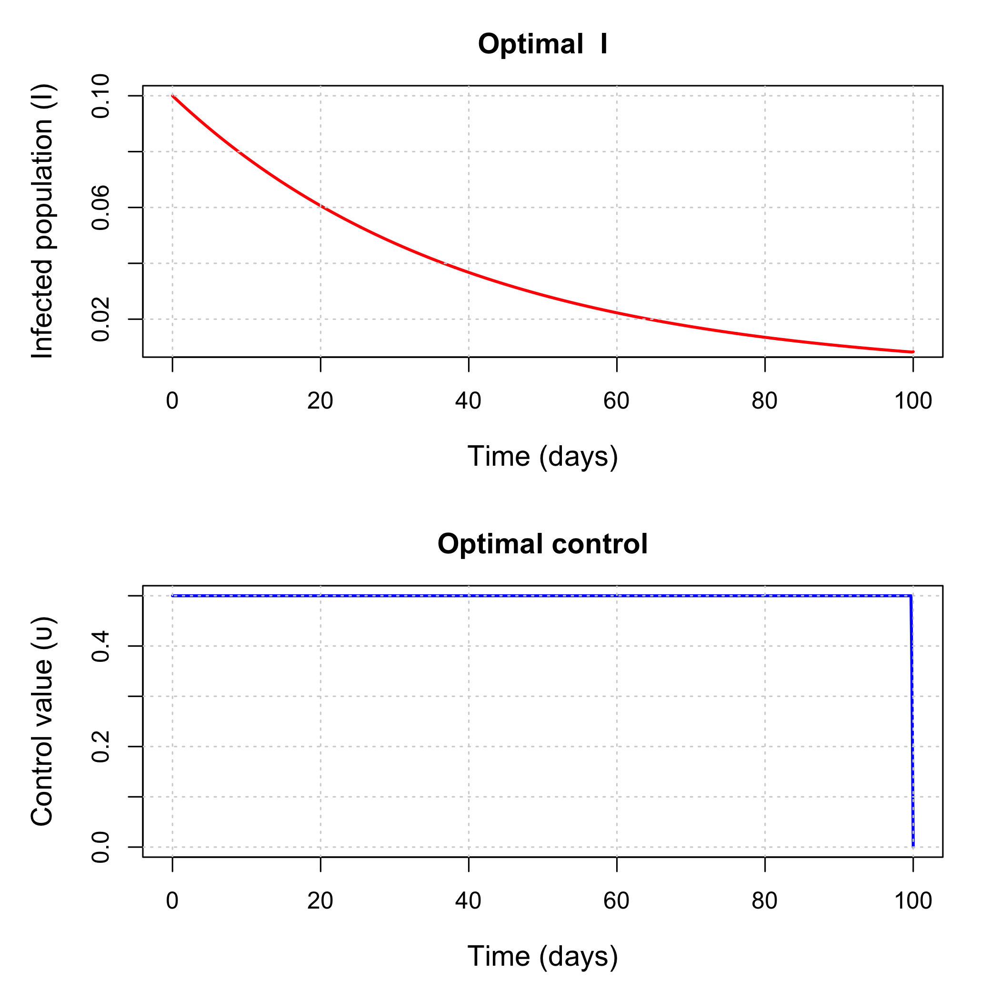

# Exponential infection model with a lockdown control using R + IPOPT
Sandra Montes (@slmontes)
2025-10-08

## Introduction

This example is based on the [exponential infection
model](https://github.com/epirecipes/EpiPolicies/blob/main/ToyModel_indirect_n_direct/exponentialSIR_indirect_n_direct.qmd)
that compares indirect and direct optimal control methods. Here we
replicate the NLP formulation of the optimal control problem solved
using Interior Point Optimisation (IPOPT), but in R instead of Julia.

The model focuses on a single compartment of infected individuals (`I`).
The intervention is modelled as a time-dependent control variable `υ(t)`
that reduces the effective transmission rate by a factor of `1 - υ(t)`,
where `υ(t) ∈ [0, 1]` represents the intensity of the applied control
(e.g., social distancing or lockdown measures).

The model is described by:

$$
\begin{aligned}
\dfrac{\mathrm{d}I}{\mathrm{dt}} &= (\beta * (1 - υ(t)) * N - \gamma) * I
\end{aligned}
$$

Here, `β` is the transmission rate, `γ` is the recovery rate, and `N` is
the total population.

In this example, the goal is to minimise both the disease burden and the
cost of interventions over time `[0, T]`. The objective function
balances:

- `A × I(t)` - Disease cost
- `B × υ(t)²` - Intervention cost

$$
\begin{aligned}
\min_{υ(t)} \sum_{t=1}^{T+1} \Delta t \cdot \left(A \cdot I_t + B \cdot υ_t^2\right)
\end{aligned}
$$

## Setup

The package `ipoptr` has not been updated since 2012, so it is no longer
found in the CRAN repository. The recommended approach is to build the R
interface directly from the official COIN-OR IPOPT source code, which
handles modern R versions and systems properly. This method uses the
official COIN-OR R interface that comes bundled with IPOPT itself, it
creates an `ipoptr` package that you can load with `library(ipoptr)`.

You can follow these steps below, or for more detailed installation
instructions, system-specific requirements, and troubleshooting, refer
to the [official COIN-OR IPOPT installation
guide](https://coin-or.github.io/Ipopt/INSTALL.html):

### Install IPOPT

**On macOS (using Homebrew):**

``` bash
brew install ipopt
```

**On Ubuntu/Debian:**

``` bash
sudo apt-get update
sudo apt-get install coinor-libipopt-dev
```

**On Windows:**

``` bash
# Using conda (recommended)
conda install -c conda-forge ipopt

# OR download from official website and install manually
# https://github.com/coin-or/Ipopt/releases
```

### Set up environment variables

**On macOS:**

``` bash
export PKG_CONFIG_PATH=/opt/homebrew/lib/pkgconfig:$PKG_CONFIG_PATH
pkg-config --cflags --libs ipopt      # should print include/lib flags
```

**On Ubuntu/Debian:**

``` bash
# Usually not needed as system package manager handles this
# But if needed:
export PKG_CONFIG_PATH=/usr/lib/pkgconfig:$PKG_CONFIG_PATH
pkg-config --cflags --libs ipopt
```

**On Windows:**

``` bash
# If using conda, usually not needed
# If manual installation, set paths to your IPOPT installation
set IPOPT_DIR=C:\path\to\your\ipopt\installation
```

### Clone and build from COIN-OR source

``` bash
git clone https://github.com/coin-or/Ipopt.git
Rscript -e 'install.packages("Ipopt/build/contrib/RInterface", repos=NULL, type="source")'
```

### Step 4: Set library path and load package

**On macOS:**

``` r
Sys.setenv(DYLD_FALLBACK_LIBRARY_PATH = "/opt/homebrew/lib")
library(ipoptr)
```

**On Ubuntu/Debian:**

``` r
# Usually not needed as system handles library paths
library(ipoptr)
```

**On Windows:**

``` r
# If using conda, usually not needed
# If manual installation, you may need to set PATH
# Sys.setenv(PATH = paste("C:\\path\\to\\your\\ipopt\\bin", Sys.getenv("PATH"), sep=";"))
library(ipoptr)
```

## Parameters

``` r
library(ipoptr)

beta  <- 0.5
gamma <- 0.25
N     <- 0.9
υ_max <- 0.5
A <- 10
B <- 0.01

I0 <- 0.1
t0 <- 0.0
tf <- 100
dt <- 0.1
T  <- as.integer(tf / dt)  # 1000
```

## R vs JuMP: Variable declaration and indexing

This section shows how R handles variable declaration compared to JuMP’s
approach. R’s ecosystem lacks the declarative modelling capabilities of
JuMP, requiring a more extensive manual management that complicates the
development process.

### R : Manual variable layout

In R, we must manually organise all decision variables into a single
vector (`x`), provide indexing functions (`idxI` and `idxU`), and handle
bounds separately from variable declaration.

``` r
# Decision vector x = [ I[1:(T+1)], υ[1:(T+1)] ]  (length n = 2*(T+1))
nI <- T + 1L  # Infected population at each time
nU <- T + 1L  # Control variable at each time
n  <- nI + nU # Total number of decision variables

# Functions for indexing variables in the decision vector
idxI <- function(t) t                 # I_t at position t (1..T+1)
idxU <- function(t) nI + t            # υ_t at position nI+t (1..T+1)
```

### JuMP : Variable declaration and bounds

``` julia
@variable(model, 0 <= I[1:(T+1)] <= 1)      # State variables with bounds
@variable(model, 0 <= υ[1:(T+1)] <= υ_max) # Control variables with bounds
```

## R vs JuMP: Objective function

### R Approach

``` r
eval_f <- function(x) {
  I  <- x[1:nI]      # Infected population
  υ  <- x[(nI+1):n]  # Control variable
  sum( dt * (A*I + B*υ^2) )  # Total cost
}

eval_grad_f <- function(x) {
  g <- numeric(n)
  # I_t: Δt × A
  g[1:nI] <- dt * A
  # υ_t: Δt × 2B × υ_t
  g[(nI+1):n] <- dt * 2*B * x[(nI+1):n]
  g
}
```

### JuMP Approach

``` julia
@objective(model, Min, sum(dt * (A * I[t] + B * υ[t]^2) for t in 1:T+1))
```

## R vs JuMP: Constraints

This section shows the fundamental difference in how R and JuMP handle
constraint specification - the core challenge that makes R optimisation
more difficult.

The epidemiological dynamics are governed by:
$$\frac{dI}{dt} = (\beta(1-\upsilon(t))N - \gamma) \cdot I(t)$$

Discretised using Euler’s method:
$$I_{t+1} = I_t + \Delta t \cdot \left((1-\upsilon_t)\beta N - \gamma\right) \cdot I_t$$

### R Approach

``` r
# Row 1: I1 - I0 = 0 (initial condition)
# Rows 2..(T+1): I_{t+1} - I_t - dt * ( (1 - υ_t)*beta*N*I_t - gamma*I_t ) = 0
m <- T + 1L  # Total number of equality constraints

eval_g <- function(x) {
  I  <- x[1:nI]      # Extract state variables
  υ  <- x[(nI+1):n]  # Extract control variables
  g <- numeric(m)    # Constraint residuals 
  
  # Initial condition: I₁ = I₀
  g[1] <- I[1] - I0
  
  # Dynamics:
  for (t in 1:T) {
    # Growth rate: (1-υ_t)βN - γ
    growth <- ((1 - υ[t]) * beta * N - gamma) * I[t]
    # Euler step: I_{t+1} = I_t + Δt × growth_rate × I_t
    g[t+1] <- I[t+1] - I[t] - dt * growth
  }
  g
}
```

### JuMP Approach

``` julia
@constraints(model, begin
    I[1] == I0                                    # Initial condition
    [t in 1:T], I[t+1] == I[t] + dt * ((1 - υ[t]) * beta * N - gamma) * I[t]  # Dynamics
end)
```

## R vs JuMP: Jacobian

The Jacobian matrix `∇g(x)` contains partial derivatives of constraints
with respect to variables:

### R Approach

``` r
# Defines which variables each constraint depends on
eval_jac_g_structure <- {
  rows <- vector("list", m)
  rows[[1]] <- c(idxI(1))  # Initial condition depends only on I₁
  for (t in 1:T) {
    # Dynamics constraint depends on I_t, I_{t+1}, υ_t
    rows[[t+1]] <- c(idxI(t), idxI(t+1), idxU(t))
  }
  rows
}

# Jacobian values
eval_jac_g <- function(x) {
  I  <- x[1:nI]      # Extract state variables
  υ  <- x[(nI+1):n]  # Extract control variables
  vals <- numeric(1 + 3*T)  # Total number of non-zero Jacobian entries
  
  k <- 1L
  # Row 1 (initial condition): ∂g₁/∂I₁ = 1
  vals[k] <- 1.0; k <- k + 1L
  
  # Rows t+1 (dynamics):
  for (t in 1:T) {
    dIdp1 <- 1.0                                            # ∂g_{t+1}/∂I_{t+1}
    dIdt  <- -1.0 - dt * ( (1 - υ[t]) * beta * N - gamma )  # ∂g_{t+1}/∂I_t
    dυdt  <-  dt * beta * N * I[t]                          # ∂g_{t+1}/∂υ_t
    
    # Order must match eval_jac_g_structure for the same row
    vals[k]   <- dIdt;   k <- k + 1L
    vals[k]   <- dIdp1;  k <- k + 1L
    vals[k]   <- dυdt;   k <- k + 1L
  }
  vals
}
```

### JuMP Approach

JuMP automatically computes and handles Jacobians, no manual Jacobian
computation is needed. The solver receives the constraint expressions
and computes derivatives automatically.

## R vs JuMP: Bounds and initialisation

### R Approach

``` r
# State variables: 0 <= I_t <= 1 (infection level as fraction of population)
# Control variables: 0 <= υ_t <= υ_max (intervention intensity)
lb <- c(rep(0, nI),      rep(0, nU))      # Lower bounds
ub <- c(rep(1, nI),      rep(υ_max, nU))  # Upper bounds

# Constraints: all equalities -> 0 == g_i(x)
# All constraints must be satisfied exactly (no tolerance)
constraint_lb <- rep(0, m)  # Lower bound for constraint residuals
constraint_ub <- rep(0, m)  # Upper bound for constraint residuals

# Initial guess: "do nothing" baseline policy
x0 <- c(rep(I0, nI), rep(0, nU))  # [I₀, I₀, ..., I₀, 0, 0, ..., 0]
```

### JuMP Approach

``` julia
@variable(model, 0 <= I[1:(T+1)] <= 1)      # State variables with bounds
@variable(model, 0 <= υ[1:(T+1)] <= υ_max) # Control variables with bounds
```

## R vs JuMP: Solver configuration and execution

This section compares how R and JuMP handle solver configuration and
execution.

### R Approach

``` r
# Configure IPOPT solver options
opts <- list(
  print_level = 3,                          # Output to monitor progress
  max_iter = 1000,                          # Maximum number of iterations
  hessian_approximation = "limited-memory"  # Use L-BFGS approximation
)

# Solve the optimisation problem
res <- ipoptr(
  x0 = x0,                           # Initial guess
  eval_f = eval_f,                   # Objective function
  eval_grad_f = eval_grad_f,         # Objective gradient
  lb = lb, ub = ub,                  # Variable bounds
  eval_g = eval_g,                   # Constraint functions
  eval_jac_g = eval_jac_g,           # Constraint Jacobian
  eval_jac_g_structure = eval_jac_g_structure,  # Jacobian sparsity pattern
  constraint_lb = constraint_lb,     # Constraint lower bounds
  constraint_ub = constraint_ub,     # Constraint upper bounds
  opts = opts                        # Solver options
)
```


    ******************************************************************************
    This program contains Ipopt, a library for large-scale nonlinear optimization.
     Ipopt is released as open source code under the Eclipse Public License (EPL).
             For more information visit https://github.com/coin-or/Ipopt
    ******************************************************************************

    Total number of variables............................:     2002
                         variables with only lower bounds:        0
                    variables with lower and upper bounds:     2002
                         variables with only upper bounds:        0
    Total number of equality constraints.................:     1001
    Total number of inequality constraints...............:        0
            inequality constraints with only lower bounds:        0
       inequality constraints with lower and upper bounds:        0
            inequality constraints with only upper bounds:        0


    Number of Iterations....: 41

                                       (scaled)                 (unscaled)
    Objective...............:   3.6984923655207211e+01    3.6984923655207211e+01
    Dual infeasibility......:   1.6092974654569493e-10    1.6092974654569493e-10
    Constraint violation....:   6.6664881080702454e-17    6.6664881080702454e-17
    Variable bound violation:   9.9939457820497068e-09    9.9939457820497068e-09
    Complementarity.........:   1.0363937798783481e-11    1.0363937798783481e-11
    Overall NLP error.......:   1.6092974654569493e-10    1.6092974654569493e-10


    Number of objective function evaluations             = 42
    Number of objective gradient evaluations             = 42
    Number of equality constraint evaluations            = 42
    Number of inequality constraint evaluations          = 0
    Number of equality constraint Jacobian evaluations   = 42
    Number of inequality constraint Jacobian evaluations = 0
    Number of Lagrangian Hessian evaluations             = 0
    Total seconds in IPOPT                               = 0.121

    EXIT: Optimal Solution Found.


    Status: 0 
    Objective: 36.98492 

### JuMP Approach

``` julia
model = Model(Ipopt.Optimizer)
set_optimizer_attribute(model, "print_level", 3)                    # Output to monitor progress
set_optimizer_attribute(model, "max_iter", 1000)                   # Maximum number of iterations
set_optimizer_attribute(model, "hessian_approximation", "limited-memory")  # Use L-BFGS approximation

# ... variable and constraint declarations ...

optimize!(model)  # That's it!

# Access to results
objective_value(model)
value.(I)  # Optimal I trajectory
value.(υ)  # Optimal υ trajectory
```

## Results

### R Approach



## Discussion

This model has:

- *1001 constraints* (one per time step + initial condition)
- *2002 variables* (state + control variables)
- *3001 non-zero Jacobian entries* (sparse structure)

For large-scale problems, this computational difference becomes more
important as R requires manual computation of all derivatives, which is
computationally inefficient compared to JuMP’s automatic
differentiation. Manual derivative computation in R scales poorly with
problem size, requiring O(n²) operations for each constraint and
variable interaction, while JuMP’s automatic differentiation leverages
optimised algorithms that scale much more efficiently. This efficiency
gap becomes increasingly significant as problem complexity grows, making
JuMP’s approach not just more convenient but more scalable for
real-world epidemiological models with thousands of variables and
constraints.
