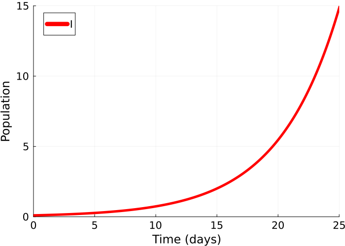
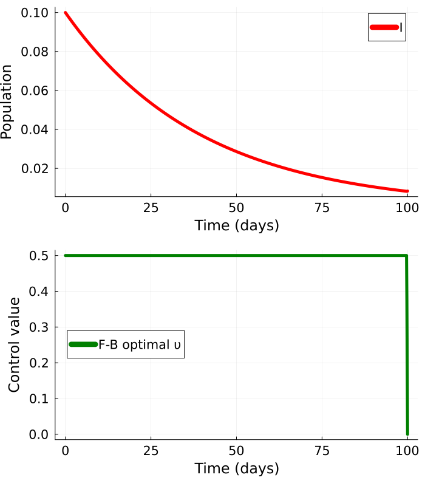
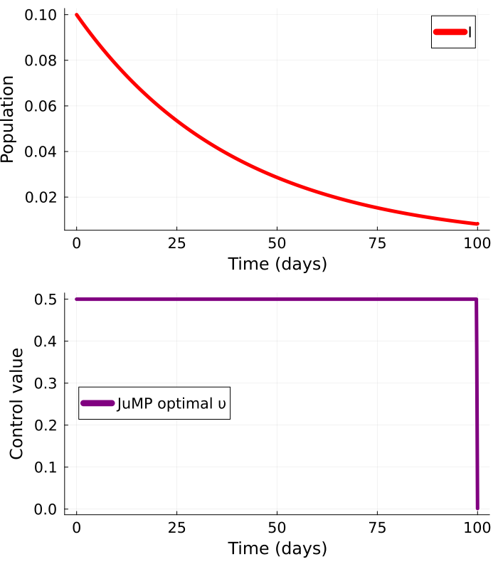

# Exponential infection model with a lockdown control using indirect and
direct methods


Sandra Montes (@slmontes), 2025-04-07

## Introduction

This example explores the optimal control of an SIR
(Susceptible-Infected-Recovered) model using a time-varying intervention
that reduces the infection rate. To simplify the dynamics, it is assumed
that the susceptible population remains approximately constant
throughout the time horizon, i.e., `S ≈ N`. This assumption is valid
during the early stages of an outbreak when the number of infections is
still relatively small compared to the total population.

Under this simplification, the model focuses on a single compartment of
infected individuals (`I`). The intervention is modelled as a
time-dependent control variable `υ(t)` that reduces the effective
transmission rate by a factor of `1 - υ(t)`, where `υ(t) ∈ [0, 1]`
represents the intensity of the applied control (e.g., social distancing
or lockdown measures).

The model is described by:

$$
\begin{aligned}
\dfrac{\mathrm{d}I}{\mathrm{dt}} &= (\beta * (1 - υ(t)) * N - \gamma) * I
\end{aligned}
$$

Here, `β` is the transmission rate, `γ` is the recovery rate, and `N` is
the total population.

In this example, the goal is to minimise the number of infected
individuals over time. To determine whether an optimal policy can be
derived both analytically and numerically, we apply Pontryagin’s Maximum
Principle (PMP) using Euler discretisation to establish the optimality
conditions and perform the numerical simulations using the
forward-backwards method. We then compare this analytical solution with
a numerical optimisation approach implemented in JuMP.jl, utilising the
IPOPT solver.

## Optimal control formulation

Objective functional:

$$
\begin{aligned}
J = \int_0^{T_f} \left[ A I(t) + B υ(t)^2 \right] dt
\end{aligned}
$$

where: - A: weight for the number of infected individuals  
- B: weight for the control effort quadratically - υ: control variable
$0 \leq υ(t) \leq υ_{max}$

Hamiltonian:

$$
\begin{aligned}
\mathcal{H}(I, υ, \lambda) = A I + B υ^2 + \lambda \cdot \left( \left( \beta (1 - υ) N - \gamma \right) I \right)
\end{aligned}
$$

where $\lambda$ is the adjoint variable associated with the state I

Adjoint equation:

$$
\begin{aligned}
\frac{d\lambda}{dt} = -\frac{\partial \mathcal{H}}{\partial I} = -A - \lambda \left( \beta (1 - υ) N - \gamma \right)
\end{aligned}
$$

Optimality condition:

$$
\begin{aligned}
\frac{\partial \mathcal{H}}{\partial υ} = 2 B υ - \lambda \cdot \beta N I = 0
\end{aligned}
$$

we then solve for υ

$$
\begin{aligned}
υ^* = \frac{\lambda \cdot \beta N I}{2 B}
\end{aligned}
$$

and add the control bounds

$$
\begin{aligned}
υ^*(t) = \min\left( \max\left( 0, \frac{\lambda(t) \cdot \beta N I(t)}{2 B} \right), υ_{max} \right)
\end{aligned}
$$

## Running the model without intervention

## Libraries

``` julia
using OrdinaryDiffEq
using JuMP
using Ipopt
using Plots;
```

Model

``` julia
function infection!(du,u,p,t)
    I = u[1]
    (β, γ, υ, N) = p
    @inbounds begin
        du[1] = (β * (1 - υ) * N - γ) * I
    end
    nothing
end;
```

Parameters

``` julia
u0 = [0.1]; #I
p = [0.5, 0.25, 0.0, 0.9]; # β, γ, υ, N
t0 = 0.0
tf = 100
dt = 0.1
ts = collect(t0:dt:tf)
alg = Tsit5();
```

Solve using ODEProblem

``` julia
prob_base = ODEProblem(infection!, u0, (t0, tf), p)
sol_base = solve(prob_base, alg, saveat=ts);
```

``` julia
plot(sol_base,
     xlim = [0, 25],
     ylim = [0, 15],
     linewidth=5, color=:red,
     xtickfontsize=14,ytickfontsize=14,
     xguidefontsize=16,yguidefontsize=16,
     label="I", legendfontsize=14,
     xlabel="Time (days)",
     ylabel="Population", size=(700,500), dpi=300)
     # savefig("baseline_expinf.png")
```



``` julia
fianl_I_base = sol_base[end][1]
println("Without control the final number of infectees is: ", 
        round(fianl_I_base, digits=-5)," at t=", tf)
```

    Without control the final number of infectees is: 4.85e7 at t=100

# Numerical simulations using the analytical formulation from PMP and forward-backward sweep

Forward-Backward Sweep Method

``` julia
function exp_sir_forward_backward(I₀, β, γ, υ_max, N, tf, dt, A=1.0, B=1.0; tol=1e-6)
    T = Int(tf / dt)
    t = range(0, tf, length=T+1)

    I = zeros(T+1); I[1] = I₀
    λI = zeros(T+1)
    υ = zeros(T+1)

    δ = 1e-3
    sweep = 0
    test = -1.0
    max_iter = 10000

    while test < 0 && sweep < max_iter
        sweep += 1

        I_old = copy(I)
        υ_old = copy(υ)
        λI_old = copy(λI)

        # FORWARD SWEEP
        for k in 1:T
            infection = dt * β * (1 - υ[k]) * N * I[k]
            recovery  = dt * γ * I[k]
            I[k+1] = I[k] + infection - recovery
        end

        # BACKWARD SWEEP
        λI[T+1] = 0.0
        for k in T:-1:1
            λI[k] = λI[k+1] + dt * (-A + λI[k+1] * (β * (1 - υ[k]) * N - γ))
        end

        # CONTROL UPDATE
        temp = -λI.*β.*N.*I./(2 .* B)
        υ_new = clamp.(temp, 0.0, υ_max)
        υ .= 0.5 .* (υ_new .+ υ_old)

        test = minimum([
            δ * sum(abs.(υ)) - sum(abs.(υ .- υ_old)),
            δ * sum(abs.(I)) - sum(abs.(I .- I_old)),
            δ * sum(abs.(λI)) - sum(abs.(λI .- λI_old))
        ])
    end

    if test ≥ 0
        println("Converged in $sweep sweeps.")
    else
        println("Did not converge in $sweep sweeps.")
    end

    # Final forward pass to get the optimal I under optimal υ
    I_opt = zeros(T+1)
    I_opt[1] = I₀
    for k in 1:T
        infection = dt * β * (1 - υ[k]) * N * I_opt[k]
        recovery  = dt * γ * I_opt[k]
        I_opt[k+1] = I_opt[k] + infection - recovery
    end

    return (; t, I=I_opt, υ, λI)
end
```

    exp_sir_forward_backward (generic function with 3 methods)

Parameters

``` julia
p2 = copy(p)
υ_max = p2[3] = 0.5   #Set υ to 0.5
β = p2[1]
γ = p2[2]
N = p2[4]
A = 10
B = 0.01
I0 = u0[1];
```

``` julia
res = exp_sir_forward_backward(I0, β, γ, υ_max, N, tf, dt, A, B)
```

    Converged in 14 sweeps.

    (t = 0.0:0.1:100.0, I = [0.1, 0.09975013732910157, 0.09950089897174622, 0.09925228336800745, 0.09900428896185647, 0.09875691420115236, 0.09851015753763248, 0.0982640174269027, 0.09801849232842773, 0.09777358070552154  …  0.008380708698505991, 0.008359768435911687, 0.008338880495216793, 0.008318044745688416, 0.008297261056920312, 0.008276529298832075, 0.008255849341668321, 0.008235221055997877, 0.008260890931513616, 0.008356005254263348], υ = [0.499969482421875, 0.499969482421875, 0.499969482421875, 0.499969482421875, 0.499969482421875, 0.499969482421875, 0.499969482421875, 0.499969482421875, 0.499969482421875, 0.499969482421875  …  0.499969482421875, 0.499969482421875, 0.499969482421875, 0.499969482421875, 0.499969482421875, 0.499969482421875, 0.499969482421875, 0.3751759118514946, 0.18858201578102318, 0.0], λI = [-367.5826563867217, -367.50039801176143, -367.4179337025231, -367.3352629434491, -367.25238521769114, -367.1693000071071, -367.08600679225754, -367.00250505240274, -366.91879426549923, -366.8348739081966  …  -8.915981485799078, -7.935799187444237, -6.953162997505451, -5.968066772652123, -4.9805043541737914, -3.990469567941634, -2.9979562243698625, -2.0029581183770278, -1.0, 0.0])

``` julia
t = res.t
u_fb_opt = res.υ
I_fb_opt = res.I

p1 = plot(t, I_fb_opt, 
     linewidth=5, color=:red,
     xtickfontsize=14, ytickfontsize=14,
     xguidefontsize=16, yguidefontsize=16,
     label="I", legendfontsize=14,
     xlabel="Time (days)",
     ylabel="Population")

p2 = plot(t, u_fb_opt, 
     linewidth=5, color=:green,
     xtickfontsize=14, ytickfontsize=14,
     xguidefontsize=16, yguidefontsize=16,
     label="F-B optimal υ", legendfontsize=14,
     xlabel="Time (days)",
     ylabel="Control value",
     legend=:left)

plot(p1, p2, layout=(2,1), size=(700,800), dpi=300)
# savefig("FB_expinf.png")
```



``` julia
fianl_I_fb = I_fb_opt[end][1]
println("Applying optimal control (Forward-Backward method) 
the final number of infectees is: ", 
round(fianl_I_fb, digits=3)," at t=", tf)
```

    Applying optimal control (Forward-Backward method) 
    the final number of infectees is: 0.008 at t=100

# Solving optimal problem using JuMP

Parameters (same as before)

``` julia
T = Int(tf/dt);
```

Model setup

``` julia
model = Model(Ipopt.Optimizer)
set_optimizer_attribute(model, "max_iter", 1000)
```

Variables

``` julia
@variable(model, 0 <= I[1:(T+1)] <= 1)
@variable(model, 0 <= υ[1:(T+1)] <= υ_max);
```

Model expressions

``` julia
@expressions(model, begin
        infection[t in 1:T], (1 - υ[t]) * β * N * I[t] * dt  # Linear approximation of infection rate
        recovery[t in 1:T], γ * dt * I[t] # Recoveries at each time step
    end);
```

Model constraints described by the expressions

``` julia
@constraints(model, begin
    I[1]==I0
    [t=1:T], I[t+1] == I[t] + infection[t] - recovery[t]
end);
```

Minimise the objective function

``` julia
@objective(model, Min, sum(dt * (A * I[t] + B * υ[t]^2) for t in 1:T+1));
```

Set model to silent to prevent printing full optimisation output

``` julia
silent = true
if silent
    set_silent(model)
end
if !silent
    set_optimizer_attribute(model, "output_file", "JuMP_lockdown.txt")
    set_optimizer_attribute(model, "print_timing_statistics", "yes")
end
optimize!(model);
```

``` julia
termination_status(model)
```

    LOCALLY_SOLVED::TerminationStatusCode = 4

``` julia
I_opt = value.(I)
υ_opt = value.(υ);
```

``` julia
p3 = plot(t, I_opt, 
     linewidth=5, color=:red,
     xtickfontsize=14, ytickfontsize=14,
     xguidefontsize=16, yguidefontsize=16,
     label="I", legendfontsize=14,
     xlabel="Time (days)",
     ylabel="Population")

p4 = plot(t, υ_opt, 
     linewidth=5, color=:purple,
     xtickfontsize=14, ytickfontsize=14,
     xguidefontsize=16, yguidefontsize=16,
     label="JuMP optimal υ", legendfontsize=14,
     xlabel="Time (days)",
     ylabel="Control value",
     legend=:left)

plot(p3, p4, layout=(2,1), size=(700,800), dpi=300)
# savefig("JuMP_expinf.png")
```



``` julia
fianl_I_jump = I_opt[end]
println("Applying optimal control (JuMP) 
the final number of infectees is: ", 
round(fianl_I_jump, digits=3)," at t=", tf)
```

    Applying optimal control (JuMP) 
    the final number of infectees is: 0.008 at t=100
