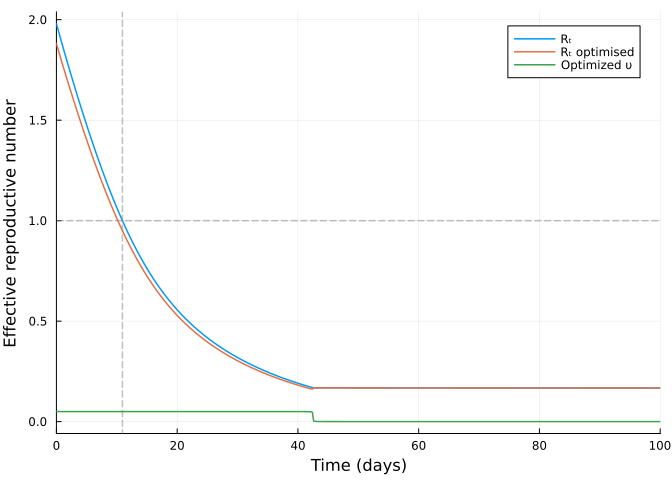

# Vaccination optimisation on an SIR model using JuMP.jl


Initial version
[here](https://github.com/epirecipes/sir-julia/blob/master/markdown/function_map_vaccine_jump/function_map_vaccine_jump.md)
by Simon Frost (@sdwfrost)  
Current version Sandra Montes (@slmontes), 2025-03-10

## Introduction

This example examines the optimal control of an SIR model through
vaccination, which reduces the number of susceptible individuals
according to the following set of equations:

$$
\begin{aligned}
\dfrac{\mathrm dS}{\mathrm dt} &= -\beta S I - \upsilon(t) S, \\
\dfrac{\mathrm dI}{\mathrm dt} &= \beta S I - \gamma I,\\ 
\dfrac{\mathrm dC}{\mathrm dt} &= \beta S I\\
\end{aligned}
$$

Similar to our previous examples, the population is divided into three
categories: susceptible individuals (`S`), infected individuals (`I`),
and the total number of cases (`C`). However in this case, Susceptible
individuals are vaccinated at a per-capita rate `υ(t)`.

The optimal control problem is defined as the policy that minimises the
total number of cases (i.e., the final size of the epidemic) while
adhering to the following constraints: (a) the vaccination rate, `υ`,
cannot exceed a maximum value, indicating a limit on the rate of
vaccination, and (b) there is a cost associated with the vaccination
process, measured as the integral of `υ(t)*S(t)` over time, which cannot
exceed a predetermined level. Again, we determine the optimal policy
numerically using a simple Euler discretisation and then JuMP.jl with
IPOPT to optimise.

## Libraries

``` julia
using OrdinaryDiffEq
using DiffEqCallbacks
using JuMP
using Ipopt
using Plots
using DataInterpolations
using NonlinearSolve;
```

## Functions

ODE system

``` julia
function sir_ode!(du,u,p,t)
    (S, I, C) = u
    (β, γ, υ) = p
    @inbounds begin
        du[1] = -β*S*I - υ*S
        du[2] = β*S*I - γ*I
        du[3] = β*S*I
    end
    nothing
end;
```

## Running the model without intervention

Parameters

``` julia
u0 = [0.99, 0.01, 0.0]; #S, I, C (cumulative incidence)
p = [0.5, 0.25, 0]; # β, γ, υ
```

``` julia
t0 = 0.0
tf = 100
dt = 0.1
ts = collect(t0:dt:tf)
alg = Tsit5();
```

Using ODEProblem

``` julia
prob1 = ODEProblem(sir_ode!, u0, (t0, tf), p)
sol1 = solve(prob1, alg, saveat=ts);
```

Without control the peak fraction of infected individuals is $\sim 16\%$

``` julia
peak_value, peak_index = findmax(sol1[2, :]) 
println("The maximum fraction of infected at a `dt` time is: ", peak_value)
```

    The maximum fraction of infected at a `dt` time is: 0.15845528864997238

``` julia
plot(sol1,
     xlim=(0, 100),
     labels=["S" "I" "C"],
     xlabel="Time (days)",
     ylabel="Fraction of population",linewidth=1.5)
```


## Searching for the optimal intervention constrained by maximum vaccination rate `υ_max`, and cost

Parameters

``` julia
p2 = copy(p)
p2[3] = 0.05;   #Set maximum vaccination rate to 0.05
β = p2[1]
γ = p2[2]
υ_max = p2[3]
υ_total = 0.75     # Maximum cost

S0 = u0[1]
I0 = u0[2]
C0 = u0[3]

T = Int(tf/dt)

silent = true;
```

Model setup

``` julia
model = Model(Ipopt.Optimizer)
set_optimizer_attribute(model, "max_iter", 1000)
if !silent
    set_optimizer_attribute(model, "output_file", "JuMP_ftc.txt")
    set_optimizer_attribute(model, "print_timing_statistics", "yes")
end;
```

Variables:

From their definition, the variables `S`, `I` and `C` are constrained to
values between 0 and 1. We constrain our vaccination policy, `υ(t)` to
lie between 0 and `υ_max`.

``` julia
@variable(model, 0 <= S[1:(T+1)] <= 1)
@variable(model, 0 <= I[1:(T+1)] <= 1)
@variable(model, 0 <= C[1:(T+1)] <= 1)
@variable(model, 0 <= υ[1:(T+1)] <= υ_max);
```

We discretise the SIR model using a simple Euler discretisation:

``` julia
@expressions(model, begin
        infection[t in 1:T], β * I[t] * dt * S[t]  
        recovery[t in 1:T], γ * dt * I[t] 
        vaccination[t in 1:T], υ[t]* dt * S[t] 
    end);
```

We constrain the integral of the intervention to be less than or equal
to `υ_total`, assuming that the intervention is piecewise constant
during each time step.

``` julia
@constraints(model, begin
    S[1]==S0
    I[1]==I0
    C[1]==C0
    [t=1:T], S[t+1] == S[t] - infection[t] - vaccination[t]
    [t=1:T], I[t+1] == I[t] + infection[t] - recovery[t]
    [t=1:T], C[t+1] == C[t] + infection[t]
    dt * sum(υ[t]*S[t] for t in 1:T+1) <= υ_total
end);
```

This scenario’s objective is to minimise the total number of cases:

``` julia
@objective(model, Min, C[T+1]);
```

``` julia
if silent
    set_silent(model)
end
optimize!(model)
```

``` julia
termination_status(model)
```

    LOCALLY_SOLVED::TerminationStatusCode = 4

``` julia
S_opt = value.(S)
I_opt = value.(I)
C_opt = value.(C)
υ_opt = value.(υ);
```

``` julia
plot(ts, S_opt, label="S", xlabel="Time (days)", ylabel="Fraction of population",linewidth=1.5)
plot!(ts, I_opt, label="I",linewidth=1.5)
plot!(ts, C_opt, label="C",linewidth=1.5)
plot!(ts, υ_opt, label="Optimized υ",linewidth=1.5)
```


With the optimised vaccine intervention, we can observe that the maximum
number of fraction of infected is $\sim 3\%$

``` julia
peak_value_opt, peak_index_opt = findmax(I_opt) 
println("The maximum fraction of infected at a `dt` time is: ", peak_value_opt)
```

    The maximum fraction of infected at a `dt` time is: 0.034552855906167204

Again, we can calculate the effective reproductive number, `Rₜ′` in the
presence of the intervention:

``` julia
Rₜ_opt = β.* S_opt ./γ   #Not taking into account the intervention
Rₜ′_opt = Rₜ_opt .* (1 .- υ_opt);  #Taking into account the intervention
```

And the time at which `Rₜ==1` using a root-finding approach:

``` julia
Rₜ_interp = CubicSpline(Rₜ_opt,ts)
f(u, p) = [Rₜ_interp(u[1]) - 1.0]
u0 = [(tf-t0)/5]
Rtprob = NonlinearProblem(f, u0)
Rtsol = solve(Rtprob, NewtonRaphson(), abstol = 1e-9).u[1];
```

``` julia
plot(ts, Rₜ_opt, label="Rₜ", xlabel="Time (days)", ylabel="Effective reproductive number", legend=:topright, xlim=(0,100),linewidth=1.5)
plot!(ts, Rₜ′_opt, label="Rₜ optimised",linewidth=1.5)
plot!(ts, υ_opt, label="Optimized υ",linewidth=1.5)
vline!([Rtsol], color=:gray, linestyle=:dash, alpha=0.5, label=false,linewidth=1.5)
hline!([1.0], color=:gray, linestyle=:dash, alpha=0.5, label=false,linewidth=1.5)
```



## Discussion

Assuming that a vaccine is available at the start of an epidemic, the
results in this example suggest that the optimal policy is to vaccinate
early and at the maximum level available until the vaccine supply is
exhausted.

The plot of `Rₜ` over time shows that, in this scenario as well as in
the lockdown scenario, the optimal policy does not aim to keep `Rₜ` at
or below 1 to prevent an increase in the infected population. Instead,
it focuses on using the available vaccine supply to achieve the lowest
possible total number of cases.
